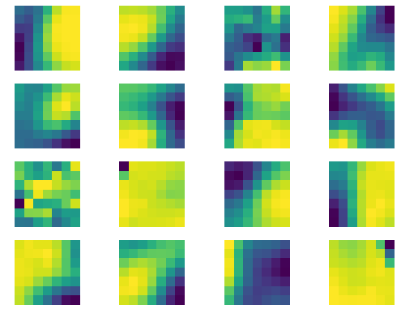
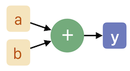
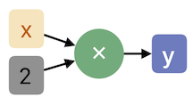
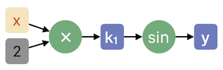

# Keras and TensorFlow essentials

**Contents**

* [Keras and TensorFlow essentials](#keras-and-tensorflow-essentials)
    * [Installation](#installation)
        * [Installing CUDA and CUDNN](#installing-cuda-and-cudnn)
        * [Installing TensorFlow](#installing-tensorflow)
    * [A first example in Keras](#a-first-example-in-keras)
        * [Loading the MNIST data set](#loading-the-mnist-data-set)
        * [Implementing the perceptron](#implementing-the-perceptron)
        * [Implementing the optimizer](#implementing-the-optimizer)
        * [Bringing it all together](#bringing-it-all-together)
        * [Evaluating the trained network](#evaluating-the-trained-network)
        * [Inspecting the losses and accuracy](#inspecting-the-losses-and-accuracy)
    * [A multi-layer perceptron (or full-connected network)](#a-multi-layer-perceptron-(or-full-connected-network))
    * [Inspecting weights and layer outputs](#inspecting-weights-and-layer-outputs)
    * [Convolutional neural networks](#convolutional-neural-networks)
    * [Larger convolutional networks](#larger-convolutional-networks)
    * [A more in-depth look at differentiable computing in TensorFlow](#a-more-in-depth-look-at-differentiable-computing-in-tensorflow)
        * [Computation graphs](#computation-graphs)
        * [Derivatives on graphs](#derivatives-on-graphs)
    * [How TensorFlow computes derivatives](#how-tensorflow-computes-derivatives)

TensorFlow is the most popular toolbox for deep learning. TensorFlow was created and is maintained by the Google Brain Team. Actually, TensorFlow is more than a deep learning toolbox: it is also a library for differentiable computing. Training deep neural networks requires computation of gradients of networks, which can be done using differentiable operators.

TensorFlow allows you to write computational graphs of operators. For each of these operators, the derivative is known. Therefore, you can backtrace the graph to find a chain of derivatives. Using the chain rule, you can construct a derivative for the full graph, which is useful in backpropagation of loss functions in neural networks (more on that later).

In addition, TensorFlow allows you to run these graphs on Central Processing Units (CPUs, where almost all code you have written in Python or Matlab runs on) *and* on Graphics Processing Units (GPUs). As the name implies, the latter are processors specialized in graphical computations (such as games). However, because that kind of computation (e.g. convolutions, inner products) significantly overlaps with the computations in neural networks, GPUs can accellerate those as well.

Summarized, TensorFlow excels at two things that are suited for training deep neural networks: differentiable computing, and GPU accelleration.

However, using TensorFlow directly means that you have to write a lot of code *de novo* every time you want to program a neural network. Therefore it is useful to run *front-ends* on top of TensorFlow that already contain the building blocks of neural networks. In these front-ends, popular layers, optimization methods, loss functions, and activation functions are already implemented. The most popular front-end to TensorFlow is Keras, and we will use it together with TensorFlow as back-end to build neural networks in this chapter.

Because Keras is such a popular front-end to TensorFlow, Keras has actually been included with TensorFlow since version 1.13.0.

In this tutorial, we will first have a look at Keras, and how it can be used to implement some simple neural networks that are slowly expanded to include more advanced techniques. As an appendix to this tutorial, we take a look at very basic TensorFlow code to explain the graph-based auto-differentiation.

This tutorial is by no means a full overview of (convolutional) neural networks, but rather introduces you to the relevant tools to implement basic algorithms.


## Installation

You can install TensorFlow and Keras using `pip` on the Anaconda distribution of Python. TensorFlow has a CPU version and a GPU version. If you want to use the GPU, you will also need to install CUDA and CUDNN. It is best to do that first

### Installing CUDA and CUDNN

If you are going to use the CPU-only version of TensorFlow, you can skip this.

If your computer has an Nvidia GPU, you can use the GPU version of TensorFlow.
For that to work however, you will also need the CUDA and CUDNN libraries. As a rule of thumb, the latest versions of CUDA, CUDNN, and TensorFlow should be compatible. If you want to install TensorFlow on a Medical Image Analysis Group server, you can skip the following to [Installing `tensorflow-gpu`].

If you have a PC running Windows or Linux, you can find the CUDA installation instructions on the Nvidia website: [Linux](https://docs.nvidia.com/cuda/cuda-installation-guide-linux/) | [Windows](http://docs.nvidia.com/cuda/cuda-installation-guide-microsoft-windows/).

The CUDNN libraries can be downloaded [here](https://developer.nvidia.com/rdp/cudnn-download). You will have to make an Nvidia account for this. The download should come with installation instructions.

### Installing TensorFlow

Fire up a terminal, and type

```bash
$ pip install --user tensorflow
```

for the CPU version and

```bash
$ pip install --user tensorflow-gpu
```

for the GPU version. After pressing enter, TensorFlow will start installing. It may take a while, depending on the speed of your connection.


## A first example in Keras

In this section, we are going to implement a simple network called a perceptron, and train it on the MNIST data set in Keras. To do so, we need three ingredients: the data, a network, and an optimizer. Let's go through using and implementing them one by one. First however, we need to import Keras.

Keras can be imported as a sub-library from TensorFlow, by putting

```python
from tensorflow import keras
```

somewhere at the start of your script. Also import NumPy and Matplotlib.

---

**Be aware that any code that imports Keras or TensorFlow will be run on the GPU automatically if you installed the GPU-optimized version of TensorFlow. If you are running this script on a server with multiple GPUs, TensorFlow will greedily use all of them to run the script, even when you only import TensorFlow or Keras. That can be annoying for people who were using the GPUs. Please use the instructions in the Linux tutorial [here](linux-essentials) to run the script on a single GPU and prevent this.**

---


### Loading the MNIST data set

First, we need to load a data set such that we can do some simple experiments. For that, we are going to use the MNIST data set that is built-in to Keras. The MNIST data set contains 60,000 images of handwritten digits between 0 and 9. The task is to find which number is in an image. To load the dataset, we use the `keras.mnist.load_data()` function, which automatically splits the data into a training and test set. However, we also require a validation set to tune parameters like the learning rate. Therefore, we are splitting the training set in two. In addition, we also need to reformat the data such that our neural networks can use them directly. In order to do all of that, we write our own `load_data()` function. To indicate what each line does, we have added comments (starting with `#`) that you can leave out in your own script.

```python
from tensorflow import keras


def load_data(nval):
    """
    Load the MNIST data set.

    Args:
        nval (int): The size of the validation set.
    Returns:
        (train_images, train_labels), (val_images, val_labels), (test_images, test_labels): Numpy arrays containing images and labels.
    """
    # Load the MNIST data train and test sets
    (train_images, train_labels), (test_images, test_labels) = keras.datasets.mnist.load_data()

    # Convert the train labels to one-hot encoding, for example if the
    # label is 3, the one-hot encoding is [0, 0, 0, 1, 0, 0, 0, 0, 0, 0], if
    # the label is 5, the one-hot  encoding is [0, 0, 0, 0, 0, 1, 0, 0, 0, 0]
    train_labels = keras.utils.to_categorical(train_labels, 10)
    test_labels = keras.utils.to_categorical(test_labels, 10)

    # Devide the train set into a train and val set,
    val_images = train_images[:nval]
    train_images = train_images[nval:]
    val_labels = train_labels[:nval]
    train_labels = train_labels[nval:]

    # Add an extra axis to the arrays of images, i.e. the shape is initially
    # (10000, 28, 28), it now becomes (10000, 28, 28, 1). This is required,
    # because Keras wants to know how many channels there are in the images.
    # Because The images are grayscale, we only have one. For RGB color image,
    # the shape would end in 3.
    val_images = val_images[:, :, :, None]
    train_images = train_images[:, :, :, None]
    test_images = test_images[:, :, :, None]

    return (train_images, train_labels), (val_images, val_labels), (test_images, test_labels)

```

You can use the function (here we are assuming a validation set size of 1000 images) as follows.

```python
(train_images, train_labels), (val_images, val_labels), (test_images, test_labels) = load_data(nval=1000)
```

---

**Tip:** If you save the function definition above as `mnist.py`, you can import it as a module (`import mnist`) in scripts in the same folder. For example, in another script you can write

```python
import mnist
(train_images, train_labels), (val_images, val_labels), (test_images, test_labels) = mnist.load_data(nval=1000)
```

---

Let's inspect some of the MNIST images. This code keeps opening MNIST images with their labels and one-hot encodings until it runs out after 59000 iterations (you probably want to cut-off execution using <kbd>Ctrl-C</kbd> after a few).

```python
for im, lab in zip(train_images, train_labels):
    plt.imshow(im[:, :, 0])
    plt.title('Labels: {}\nOne-hot encoding: {}'.format(np.argmax(lab), lab))
    plt.show()
```


### Implementing the perceptron

When tackling a new problem, it is best to start simply. Therefore, we are first going to train a perceptron on the MNIST data set. A perceptron is a single-layer neural network: it connects the input and output directly with a matrix of weights connecting all inputs with all outputs. Right now, for each 28 x 28 image, we have 28^2 or 784 input values, and because we have to be able to predict 10 different digits, we have 10 outputs. That means, the weights in the middle of the perceptron will number 7850, if we include the ten bias weights. Given the input vector **x** and weight matrix **W**, we compute the output **y** as **y** = *f* (**W x** + **b**), where *f* is the activation function. In this case, it will be a multi-dimensional sigmoid, which is also called the soft-max function. If maps a vector of values to a vector of probabilities that add up to one. In our case, it means that the perceptron outputs a vector of ten probabilities, each corresponding to a digit between 0 and 9. If we train it well, the highest probability will correspond to the digit in the image.

The perceptron code in Keras is relatively short. Let's write a function to create the perceptron:

```python
def create_perceptron(input_shape, n_outputs):
    network = keras.models.Sequential()

    network.add(keras.layers.InputLayer(input_shape))
    network.add(keras.layers.Flatten())
    network.add(keras.layers.Dense(n_outputs, activation='softmax'))
    return network
```

As you can see, all elements from the equation **y** = *f* (**W x** + **b**) are there: the input layer accepts an input image and flattens it to a vector **x**; the `Dense` layer computes the inner product with a weight matrix **W**; and the activation function *f* is a parameter to the `Dense` layer.

These layers are all added to a `Sequential` model object. `Sequential` is one of two options to construct networks on in Keras. The other is a class called `Model`. This class allows a little bit more customization, and it is good to be aware of this option should you want to build a more complex network. For now we are going to stick with the `Sequential` class however.


### Implementing the optimizer

This part is even simpler, because the optimizers are built-in to Keras. We are first going to use the simple Stochastic Gradient Descent (SGD) optimizer. It can be done in a single line:

```python
sgd = keras.optimizers.SGD(lr=1e-4)
```

The SGD class has one attribute you need to specify, which is the learning rate `lr`. It is a parameter that needs finetuning, but 0.0001 is a good first guess.

### Bringing it all together

If you have implemented (and imported if you put them in separate files) the `load_data()` and `create_perceptron()` functions, the following script will build and train the perceptron on the MNIST data.

```python
import numpy as np
from tensorflow import keras

### ... import or define load_data() and create_perceptron() here ...
(train_images, train_labels), (val_images, val_labels), (test_images, test_labels) = load_data(nval=1000)

perceptron = create_perceptron(input_shape=(28, 28, 1), n_outputs=10)
sgd = keras.optimizers.SGD(lr=1e-4)

perceptron.compile(loss='categorical_crossentropy', optimizer=sgd, metrics=['accuracy'])

logs = perceptron.fit(train_images, train_labels, batch_size=16, epochs=20, verbose=1, validation_data=(val_images, val_labels))
```

So, what is happening here? Well, first we load the data, create the perceptron, and instantiate the optimizer. Then we need to do something critical: compiling the network. This means: translating the Python code that creates the network to very fast, GPU-optimized C++ code. The training and validation code is similarly optimized, which massively speeds up the training. The loss function we use here is categorical cross entropy, which is the default option for classification problems. We also ask the network to compute the classification accuracy on the validation set. This should approach one by the end of training.

The `fit` method, does the actually training on the training set, and validates it on the validation set at the end of each epoch. An epoch is a run through the full data. We are training for 20 epochs here. We also indicate we are fine with Keras reporting the training and validation loss on the screen (`verbose=1`). Finally, we ask that Keras trains on a batch of 16 images every iteration. Hence, it will randomly select 16 images from the training set, run them through the network and backpropagate the accumulated error through the network.

When you run the code above, you will see that in the output screen or terminal, Keras is indeed quite chatty:

```
Epoch 1/100
59000/59000 [==============================] - 4s 69us/sample - loss: 9.6544 - acc: 0.8380 - val_loss: 6.4034 - val_acc: 0.8780
Epoch 2/100
59000/59000 [==============================] - 4s 63us/sample - loss: 5.9434 - acc: 0.8725 - val_loss: 10.9197 - val_acc: 0.7970
Epoch 3/100
59000/59000 [==============================] - 4s 65us/sample - loss: 5.2455 - acc: 0.8765 - val_loss: 9.6945 - val_acc: 0.8290
Epoch 4/100
59000/59000 [==============================] - 4s 63us/sample - loss: 4.9306 - acc: 0.8794 - val_loss: 6.6047 - val_acc: 0.8440
Epoch 5/100
31504/59000 [===============>..............] - ETA: 1s - loss: 4.5944 - acc: 0.8553
```

It shows a progress bar for the current epoch, and the loss, accuracy, valdiation loss, and validation accuracy. As you can see, even for this simple model we can obtain an accuracy close to 90%.

### Evaluating the trained network
We can test if this also holds for the test set using the `predict()` method of the perceptron:

```python
predictions = perceptron.predict(test_images)
```

The result will be 10,000 vectors (the size of the test set) of one-hot encodings. To get the predicted values from these, you can use the `np.argmax` function on each element

```python
predicted_values = [np.argmax(*x*) for x in perceptron.predict(test_images)]
```

---

**Tip:** If you are not familiar with list comprehensions, the syntax above may seem weird. A list comprehension is a fast way of typing simple loop functions in Python. For example `[x**2 for x in range(1, 11)]` is a fast way of computing a series of squares ([1, 4, 9, 16, 25, 36, 49, 64, 81, 100]). The longer equivalant would be
```python
l = []
for x in range(1, 11):
    l.append(x**2)
```

---


### Inspecting the losses and accuracy

Now, to see what has happened during training, we can plot the historical data in the log variable:

```python
print(logs.history)
```

The output is a dictionary with the accuracy and losses throughout time:

```
{'acc': [0.8358644, 0.8715085, 0.8780847, 0.87977964, 0.8797288, 0.8832034, 0.882322, 0.8832203, 0.88457626, 0.88355935, 0.88442373, 0.8846102, 0.88405085, 0.8857627, 0.8858983, 0.8852712, 0.8861017, 0.8855085, 0.88581353, 0.8862881], 'loss': [9.482102827875465, 5.979360750774595, 5.256691946717091, 4.945961889404416, 4.731675396229354, 4.519518793621319, 4.535536921357306, 4.377185181109588, 4.339643277233552, 4.246108797395099, 4.283696255348472, 4.216456433320189, 4.213387882255547, 4.151757075365496, 4.122857839084604, 4.163488399723753, 4.098976281114397, 4.131789697225271, 4.038784947487431, 4.106353906194537], 'val_acc': [0.876, 0.867, 0.856, 0.782, 0.889, 0.876, 0.891, 0.869, 0.844, 0.789, 0.843, 0.897, 0.889, 0.863, 0.888, 0.906, 0.881, 0.895, 0.87, 0.876], 'val_loss': [6.251821246576737, 5.933568036003553, 6.2133656541744715, 9.655746141361073, 4.589115062267438, 4.943115128427742, 4.630859735258407, 5.603506701649708, 6.314110506534537, 9.997330449748784, 6.299870411154832, 4.440934463687448, 5.201783660039859, 5.018002709839374, 4.5343343787482775, 3.72042638624366, 5.190236610084539, 4.1187336103931145, 5.393824457332024, 5.703942201962352]}
```


---

###### Exercises

1. Make two plots. Plot the training and validation loss curves in one plot, and the training and validation accuracy in the other.

    <details><summary>Answer</summary><p>

    ```python
    import matplotlib.pyplot as plt
    fig, ax = plt.subplots(1, 2)
    ax[0].plot(logs.history['loss'])
    ax[0].plot(logs.history['val_loss'])
    ax[0].legend(['loss', 'val_loss'])
    ax[1].plot(logs.history['acc'])
    ax[1].plot(logs.history['val_acc'])
    ax[1].legend(['acc', 'val_acc'])
    plt.show()
    ```
    </p></details>

2. Compute the confusion matrix for the test set. A confusion matrix is a 2D histogram with on one axis the true labels, and on the other axis the predicted labels by the network. Plot the histogram as an image. What does it show? What does it show when you train for only one epoch?

    <details><summary>Answer</summary><p>

    In a 2D histogram you are counting co-occurences in two vectors, in this case the predicted and true values. We start with a 10 x 10 matrix of zeros and add 1 to a bin for every predicted/true pair.

    ```python
    predicted_values = [np.argmax(*x*) for x in perceptron.predict(test_images)]
    true_values = [np.argmax(*x*) for x in test_labels]

    confusion_matrix = np.zeros((10, 10))
    for pred, true in zip(predicted_values, true_values):
        confusion_matrix[pred, true] += 1

    plt.imshow(confusion_matrix)
    plt.xlabel('True digit')
    plt.ylabel('Network output')
    plt.show()
    ```

    It should show high values on the diagonal, indicating that in most cases, the network predicts the correct digit. Digits that look similarly when hand-written (e.g. 1 and 7, 3 and 8, or 4 and 9), can also lead to higher values, especially when limiting the amount of training.
    </p></details>

3. Try to optimize the learning rate. Can you get an even higher validation accuracy?

---


## A multi-layer perceptron (or full-connected network)

Of course, it is now easy to add more `Dense` layers to the network. Let's do that:

```python
def create_mlp(input_shape, n_outputs):
    network = keras.models.Sequential()

    network.add(keras.layers.InputLayer(input_shape))
    network.add(keras.layers.Flatten())
    network.add(keras.layers.Dense(256, activation='relu'))
    network.add(keras.layers.Dense(n_outputs, activation='softmax'))
    return network
```

Here we have added one extra layer, with 256 'neurons'. These neurons have a rectified linear unit (ReLU) activation function. If you run this network instead of the single layer perceptron, you will notice the accuracy will be higher than with a single layer. This Multilayer Perceptron (MLP) design used to be state of the art in neural network design until quite recently.

###### Exercises

1. How many trainable weights are in this MLP?

    <details><summary>Answer</summary><p>
    The input layer has 28 x 28 inputs that are flattened to a 784-length vector. The middle layer has 256 units. The last layer has 10 units. Between the input and middle layer, there are 784 * 256 normal weights and 256 bias weights. The output layer has 256 * 10 normal weights and 10 bias weights, so 203530 weights in total.
    </p></details>

2. Train the MLP for 20 epochs. Look at the loss curves of the MLP. It is likely that your network is overfitting. How do you see this in these curves? Why do you think the network overfits?

    <details><summary>Answer</summary><p>
    It is likely that the training accuracy has not converged after 20 epochs, i.e. it is still rising, while the validation accuracy is staying constant or even *decreasing* after a few epochs.

    Using the architecture as defined above, there are so many parameters, that the network will overfit on details or noise in the training set (e.g. it will know that a certain image of a 9 in the training set has some noise in the top right and use that to deduce it is should output 9, because it was taught that in previous epochs.). The network will specialize so much on the training set that in this case it can easily reach an accuracy on that set of 100%.
    </p></details>

3. How can you combat the overfitting without adding more code?

    <details><summary>Answer</summary><p>
    Reducing the number of neurons in the hidden middle layer. Try using 64 units instead of 256. This time, the validation and training curves will be much more similar, indicating there is no overfitting. It may even be beneficial to train for more epochs if the training has not converged yet.
    </p></details>

---


## Inspecting weights and layer outputs

Sometimes it is useful to get the learned weights and biases out of the network. To get the weights of the MLP we have trained in the previous section, we first get the individual layers of the network:

```python
layers = mlp.layers
```

A layer instance has a `get_weights()` method. However, not every layer has weights. For example, the first layer is the `Flatten` layer, which has no weights at all. The second and third layer are `Dense` layers that have weights matrices and bias vectors. You can extract these using

```
[W1, b1] = layers[1].get_weights()
[W2, b2] = layers[2].get_weights()
```

From here, you can plot the matrices and check the bias weights. This becomes especially interesting when looking at convolutional neural networks.

When we run the `predict()` method, we obtain the result of the last layer. However, sometimes, it is interesting to see intermediate results of the network. This requires compiling a new sub-network:

```python
layer1 = mlp.layers[1]
layer1_output = keras.function([mlp.input], [layer1.output])
```

This may seem strange. Why do we need to create this `function()` thing? If you look back at how we defined the networks before, you may remember we had to compile it. When we did that, a Keras `function()` object was created implicitly. Here we are essentially making a new network from the old one, in which we have a new output. Hence, we need to make a Keras function. The `function()` function has two parameters: a list of inputs, and a list of outputs. Here we take the same input from the `mlp` network, but as output we take the selected layer. The function is called `layer1_output()` and can be called like a normal Python function, returning the list of outputs. In this case there is only one output, so we need to take the output at index 0:

```python
intermediate_output = layer1_output(train_images[39][None])[0]
```

This will give the first layers output for the 40th image in the MNIST data set. Note that the `layer1_output()` function expects something with the size `(None, 28, 28, 1)`, i.e. a batch of 28x28 images with one channel. Hence, we need to add a dimension (with `[None]`). The output will be a list of outputs, which in this case only contains one item that we extract with `[0]`.


## Saving and loading learned weights

It would be a pity if you trained a large network for hours on end but could only use it within the training script. It is therefore a good idea to save checkpoints of the weights every epoch. Another option is to only save the checkpoint of the epoch with the best validation loss. Keras implements saving checkpoints as a so-called callback in the `fit()` function.

To save only the best epoch's weights, you can run the network like this:

```python
checkpoint = keras.callbacks.ModelCheckpoint('best_checkpoint.hdf5', monitor='val_acc', verbose=1, save_best_only=True, mode='max')
logs = mlp.fit(train_images, train_labels, batch_size=16, epochs=20, verbose=1, validation_data=(val_images, val_labels), callbacks=[checkpoint])
```

To save a checkpoint each epoch, you can do this:

```python
checkpoint = keras.callbacks.ModelCheckpoint('checkpoint_{epoch:02d}.hdf5', monitor='val_acc', verbose=1, save_best_only=False, mode='max')
logs = mlp.fit(train_images, train_labels, batch_size=16, epochs=20, verbose=1, validation_data=(val_images, val_labels), callbacks=[checkpoint])
```

In the latter command, the epoch number will automatically appear in the filename. The hdf5 files will be stored in the same folder as your script.
To load a checkpoint, the `Sequence` class has a `load_weights()` method, e.g.

```python
mlp.load_weights('best_checkpoint.hdf5')
```

or to load a specific epoch's weights:

```python
mlp.load_weights('checkpoint_{epoch:02d}.hdf5'.format(19))
```

If you put one of these lines in your script before compiling the network, you can make predictions using the loaded network, or restart training. Especially when training for a long time it is wise to save these checkpoints of your network.


## Convolutional neural networks

When using images it does not make much sense to use `Dense` fully connected layers. Convolutional layers make much more sense: they are translation equivariant (if you are a mathematician) or covariant (if you are a physicist), and require far fewer parameters compared to perceptrons. The most simple thing we can do to turn the perceptron from the previous examples into a convolutional neural nework (CNN) is by adding a convolutional layer:

```python
def create_larger_cnn(input_shape, n_outputs):
    network = keras.models.Sequential()

    network.add(keras.layers.InputLayer(input_shape))
    network.add(keras.layers.Conv2D(16, (3, 3)))
    network.add(keras.layers.Flatten())
    network.add(keras.layers.Dense(n_outputs, activation='softmax'))
    return network
```

Here we used a 2D convolutional layer (because the image is 2D). The layer will learn 16 kernels of nine values arranged as 3x3 matrices. Like the dense layers, it will also compute a bias, computing an output *y* as **y** = *f* (**W** ✶ **x** + **b**). The ✶ indicates convolution[^correlation] and by default, the activation function *f* will be ReLU.

[^correlation]: Technically, the layer performs correlation instead of convolution, as for true convolution the kernel should be mirrored. Usually, this is ignored in papers in literature, except when mathematicians were involved in writing the paper.

---

###### Exercises

1. How many weights in total does the 16-unit convolutional layer learn? If we would replace it with a 16-unit fully-connected layer, how many weights would that layer learn?

    <details><summary>Answer</summary><p>
    The convolutional layer learns 16 x 3 x 3 + 16 = 160 weights. The fully-connected layer would learn 28 x 28 x 16 + 16 = 25120 weights. The fully-connected layers learn connections between all inputs and the outputs of the layer, which means they learn vastly more weights than a convolutional layer. The convolutional layer still takes the full image into account, without requiring that number of weights.
    </p></details>

2. What is the output size of the convolutional layer?

    <details><summary>Answer</summary><p>
    The output will be 16 feature maps of size 26 x 26. This is because by default, the convolutional layer computes *valid* convolutions, that is, convolutions in which the kernel always covers only pixels inside the image. If you overlay the kernel at the top left of the image, you will see that there is no output for the top row en leftmost column. The same holds for the bottom row and rightmost column. The output of the layer will therefore be 1 x 26 x 26 x 16. You can check this using the following code:

    ```python
    print('Shape of layer 0:', cnn.layers[0].output_shape)
    ```

    </p></details>

3. Does this network work better compared to the perceptron?

    <details><summary>Answer</summary><p>
    It should work slightly better. You can get much higher accuracy with more convolutional layers however.
    </p></details>

4. Change the kernel size to 7x7 and inspect the learned kernels after 20 epochs with a learning rate of 0.01. What do the kernels look like?

    <details><summary>Answer</summary><p>
    Change the kernel size from (3, 3) to (7, 7). The kernels can be plotted using

    ```python
    [W0, b0] = cnn.layers[0].get_weights()
    fig, ax = plt.subplots(4, 4)
    for i in range(16):
        ax.flatten()[i].imshow(W0[:, :, 0, i])

    [x.set_axis_off() for x in ax.flatten()]
    plt.show()
    ```

    A nice visualization may require longer training, or a higher learning rate.
    The result should show smooth edge filters, something like this:

    

    </p></details>

---


## Larger convolutional networks

In most convolutional neural networks, pooling layers are used to downsample the feature maps. This acts as an extra non-linearity, but also reduces the amount of data, forcing the network to learn more abstract features. A fairly typical examples is this network:

```python
def create_larger_cnn(input_shape, n_outputs):
    network = keras.models.Sequential()

    network.add(keras.layers.InputLayer(input_shape))
    network.add(keras.layers.Conv2D(32, (3, 3)))
    network.add(keras.layers.Conv2D(32, (3, 3)))
    network.add(keras.layers.MaxPooling2D((2, 2)))

    network.add(keras.layers.Conv2D(64, (3, 3)))
    network.add(keras.layers.Conv2D(64, (3, 3)))
    network.add(keras.layers.MaxPooling2D((2, 2)))

    network.add(keras.layers.Flatten())
    network.add(keras.layers.Dense(n_outputs, activation='softmax'))
    return network
```

As you can see, we have specified a pooling size of 2x2, and use max-pooling: in the 2x2 windows the network selects the maximum value of each feature map. This will effectively downsample the feature maps by a factor four.

---

###### Exercises

1. Without using an `output_shape()` method, what is the output shape of the second max-pooling layer here? Check your answer using the method.

    <details><summary>Answer</summary><p>
    The input to the network is 28 x 28. The feature maps of the first convolutional layer are 26 x 26, for the second convolutional layer 24 x 24, then 12 x 12 for the pooling layer, 10 x 10 for the third convolutional layer, 8 x 8 for the fourth, and 4 x 4 for the second pooling layer. Because the convolutional layer before it computed 64 feature maps, the output of the pooling layer should be 1 x 4 x 4 x 64. You can check it using this code:

    ```python
    print(cnn.layers[5].output_shape)
    ```
    </p></details>

2. On the Keras documentation webpage [keras.io](keras.io) you can find information about more layers included in Keras. Read the documentation for the `BatchNormalization` layer which normalizes the activations of a layer to zero mean and unit standard deviation. Add it after all the convolutional layers in the network above. Does this improve performance?

3. Keras has multiple optimizers built-in in addition to SGD. An example is the Adam optimizer. Try to train the network again using the Adam optimizer and make sure you tweak the learning rate again. Can you obtain a better result than before using this optimizer?

4. Try to beat our record on the MNIST data set of 98% accuracy using the architecture above as a basis. Be sure to at least tweak the learning rate, and increase the number of epochs. New MNIST records can be emailed to awesome_mnist_results@gullible.com. Good luck!

---


## A more in-depth look at differentiable computing in TensorFlow

This section is in no way required to train your own neural networks in projects or courses at TU/e. However, it may be useful to obtain some intuition on how those networks are actually trained. The network is optimized using a steepest descent algorithm, like SGD or a variant like Adam. For this, it is necessary to compute the derivative of the loss function with respect to all learnable weights, kernels, and biases. This is done symbolically: TensorFlow computes those derivatives using the chain rule, product rule, quotient rule, and rules specific to other operators (e.g. *d/dx sin*(*x*) = *cos*(*x*), *d/dx exp*(*x*) = *exp*(*x*), etc.). To see how this works in practice, we have some small examples to show how TensorFlow does this. For that, we start simple.

The simplest functional TensorFlow program we could think of is adding two numbers. The code to do that in TensorFlow is this:

```python
import tensorflow as tf

sess = tf.Session()

a = tf.placeholder(tf.float32)
b = tf.placeholder(tf.float32)
y = a + b

result = sess.run(y, feed_dict={a: 1, b:2})
print(result)
```

which will print '3' (thankfully...).

That seems like an awful lot of code for something so simple. Let's break it down to understand why we need all this session and placeholder misery.

1. The first line imports TensorFlow and gives it the alias `tf`.

2. Then we make a new TensorFlow session. A 'session' is more or less similar to a compiler. It will translate the code to high-performace `C++` and then execute it on the CPU or GPU, depending on which version of TensorFlow you installed.

3. Next, we make two placeholder variables, `a` and `b`. These are exactly what the sound like: place holders for data (i.e. tensors). TensorFlow is a lot more declarative about variables than Python: it forces us to declare beforehand what `a` and `b` will contain: 32-bit floating point values.

4. Then, we put the *operation of adding `a` and `b`* in `y`. This is an important distinction, we do not calculate anything on the line `y = a + b`, rather we say that if you want to run `y`, you need to add `a` and `b`.

5. Next, we do exactly that: we run `y` and feed `1` and `2` to the placeholders `a` and `b`. The `run()` method of the session object will translate the code to `C++` and run it on the CPU and return the result of the whole operation.

This is a rather contrived example, and of course calling the compile to do something this mundane will not lead to faster code (in fact, translating that code to C++ will be a lot slower than just adding those numbers). However, for large computational graphs that will be executed thousands of times, that translation is worth it.

By the way: if you run the code above you will get a lot of output on your screen, that tells you how the code is being run and on which processor. You can safely ignore that if everything works, but it can be useful to troubleshoot.


### Computation graphs

However small this example is, we can actually use it to show what TensorFlow is doing. If we cut-off the script above, and instead print `y`, we will see what it is doing behind the scene:

```python
import tensorflow as tf

sess = tf.Session()

a = tf.placeholder(tf.float32)
b = tf.placeholder(tf.float32)
y = a + b

print(y)
```

This will print the following

```
Tensor("add:0", dtype=float32)
```

So what is `y`? It is a 32-bit float tensor, in this case with the rather unimaginative name 'add:0', which just is an automatic name. It is also an edge (that is a link between nodes) of the computation graph. The operators are the nodes of this graph. That plus operation between `a` and `b` is therefore a node. The two placeholders are edges as well. Hence, a graphical representation would be this:




This shows you, that in TensorFlow, the data (i.e the tensors) are the stuff that moves around along the edges of a graph of operators.

Why is that useful? It is the perfect way of describing the forward pass and backward pass of a neural network. For that backward pass we need...


### Derivatives on graphs

Let's look at another example, where we multiply a number by a constant factor of 2:

```python
import tensorflow as tf

sess = tf.Session()

x = tf.placeholder(tf.float32)
y = 2 * x
```

The graph for this looks like this:



Nothing too exciting. What *is* exciting (ok, maybe not to everone) is the fact that TensorFlow can traverse the graph backwards to compute the derivative of `y` with respect to `x`. Note that that is only possible because the graphs are defined with placeholder inputs, and because of the graphical organization.

Of course, everyone knows that the derivative is `2` in this case. Let's see if TensorFlow agrees:

```python
import tensorflow as tf

sess = tf.Session()

x = tf.placeholder(tf.float32)
y = 2 * x

dy = tf.gradients(y, x)[0] # The derivative of y with respect to x

with sess.as_default():
    result = sess.run(gy, feed_dict={x: 0})

print(result)
```

Which will print `2.0`.


---

###### Exercises

1. We have now shown that the derivative is 2.0 at the point x = 0. Show that this holds for every point between -10 and 10. You can use the fact that the `run()` method also accepts NumPy arrays as inputs, and that TensorFlow can broadcast arrays just like Numpy.

    <details><summary>Answer</summary><p>

    ```python
    import tensorflow as tf
    import numpy as np

    sess = tf.Session()

    x = tf.placeholder(tf.float32)
    y = 2 * x

    dy = tf.gradients(y, x)[0] # The derivative of y with respect to x

    x_values = np.linspace(-10, 10, 1e6)

    with sess.as_default():
        result = sess.run(dy, feed_dict={x: x_values})

    print(np.all(result == np.float(2.0)))
    ```

    Should print `True`. Since we tested it for 1 million equidistant points between -10 and 10, we can safely assume TensorFlow gets the derivative right here.

    </p></details>

2. The derivative of *sin*(*x*) is *cos*(*x*). Show that TensorFlow agrees by plotting the derivative of sin(*x*) between -2π and 2π. Note that for operators like *sin* and *cos* you need to use TensorFlow's versions `tf.sin()` and `tf.cos()`.

    <details><summary>Answer</summary><p>

    ```python
    import tensorflow as tf
    import numpy as np
    import matplotib.pyplot as plt

    sess = tf.Session()

    x = tf.placeholder(tf.float32)
    y = tf.sin(x)

    dy = tf.gradients(y, x)[0] # The derivative of y with respect to x

    x_values = np.linspace(-2 * np.pi, 2 * np.pi, 1e4)

    with sess.as_default():
        y_values = sess.run(dy, feed_dict={x: x_values})

    plt.plot(x_values, y_values)
    plt.show()
    ```

    This should show the graph of *cos*(*x*).

    </p></details>

---


## How TensorFlow computes derivatives

So how does TensorFlow know that the derivative of 2 × *x* is 2 and the derivative of *sin*(*x*) is *cos*(*x*)? Well, it just knows. It has a large look-up table for every operator in which it can look up what it should do. Does the function contain a constant multiplied by the variable? Then the derivative is equal to the constant. Does the function contain a sine? Then the derivative is a cosine. Is there a product of two functions? Then it will apply the product rule. It just looks these things up in a table.

Whenever a function is composed of multiple operators (i.e. sin(2 × x)), it applies operator *priority* and the chain rule. The priority is implicit in the graph. In the sin(2 × x) example, it understands that the graph looks like this:



Hence, to compute *dy/dx*, TensorFlow traverses the graph upwards, first computing the derivative of *sin*(*g*(*x*)) w.r.t. x. It looks up that for a function sin(g(*x*)) the derivative is *cos*(*g*(*x*)) × *g*'(*x*). Then, it needs to go further up the graph to compute *g*'(*x*) = 2 × *x*. Because it knows that the derivative of a constant times a variable is equal to the constant, it will return 2. Then it assembles the full derivative as being *cos*(2 × *x*) × 2.

In essence, it does nothing more than what you learned in your Calculus courses.
