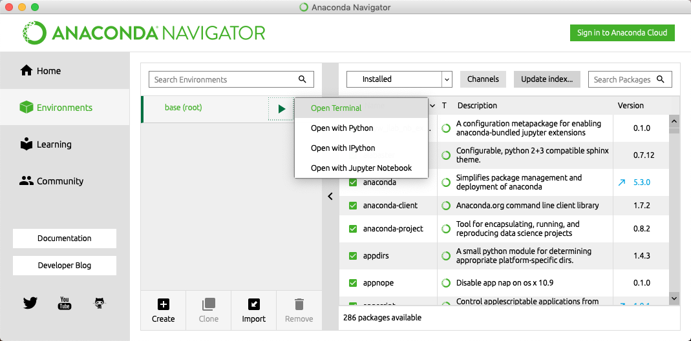

# Working with medical images in Python

In this chapter, a few modules and methods for working with medical images are
discussed. These packages are not included with the Anaconda installation you
(may) have installed previously. Therefore this chapter will also discuss how to install packages in Python.


## Installing extra Python packages

Anaconda comes with the `pip` package manager. You can run `pip` from a Terminal window (on Linux or macOS) or a Command Prompt or Cygwin window on Windows, provided you have added the Anaconda distribution to your PATH during installation. Alternatively, you can open a prompt or terminal from the Anaconda Navigator by clicking on `Environments` in the left side bar, clicking on the green triangle, and then 'Open Terminal'.



In the Terminal, the Windows Prompt, or the Anaconda Terminal, you can use `pip` to install packages. For example, to install the package `SimpleITK`, use

```bash
pip install --user SimpleITK
```

We are going to use SimpleITK to load `*.mhd` and DICOM files later. To be able to read 2D image files, also install the package `imageio` this way. 


## Working with 2D image files (i.e. `*.jpg`, `*.png`, `*.tiff`)

To read and write images we import the `imageio` library. 

```python
import imageio
```

`imageio` supports almost all 2D image formats, such as `jpg`, `bmp`, `gif`, and `tiff`.

You can read any such file on your computer if you supply the path of the image to the `imageio.imread()` function, like this:

```python
my_image = imageio.imread('path/to/image')
```

`my_image` now contains a NumPy array with the intensities of the image. If the file contains a color image, it will be loaded in the format we discussed at the end of the previous section. You can show the image using Matplotlib:

```python
plt.imshow(my_image)
plt.show()
```


---

###### Exercises

1. Load a color image using `imageio`. Make changes to the image array, such that the image becomes a grayscale image. Show the color and grayscale images next to each other. If you can not find an image, you can use the path `imagio:chelsea.png`, which loads one of the example images in `imageio`. 
    
    <details><summary>Answer</summary><p>

    Example code:

    ```python
    color_image = imageio.imread('imageio:chelsea.png')
    grayscale_image = np.mean(color_image, axis=2)
    fig, ax = plt.subplots(1, 2)
    ax[0].imshow(color_image)
    ax[1].imshow(grayscale_image, cmap='gray')  # If you do not use the gray color map, Matplotlib will use its default color map.
    plt.show()
    ```

    </p></details> 

---


## Working with `*.mhd` files

`*.mhd` files are used in Elastix and the ITK software packages. These files can 
be opened using the SimpleITK package, which is a rather schizophrenic translation of
ITK to Python. The functions in this package do *not* adhere to Python conventions. For example, all functions have capitalized camel case names (i.e. `ReadImage` instead of `read_image`). 
The following code loads an image from the `example_data` folder in this repository and then retrieves the array of pixel intensities as a NumPy array.


```python
import SimpleITK as sitk
import numpy as np
import matplotlib.pyplot as plt

itk_image = sitk.ReadImage('example_data/chest_xray.mhd')
image_array = sitk.GetArrayFromImage(itk_image)

# print the image's dimensions
print(image_array.shape)

# plot the image
plt.imshow(image_array, cmap='gray')
plt.show()
```

`*.mhd` files themselves are pure text header files that contain properties of the images.
For example, for the `chest_xray.mhd` file, the parameters read

```python
ObjectType = Image
NDims = 2
BinaryData = True
BinaryDataByteOrderMSB = False
CompressedData = False
TransformMatrix = 1 0 0 1
Offset = 0 0
CenterOfRotation = 0 0
ElementSpacing = 1 1
DimSize = 1024 1024
ElementType = MET_DOUBLE
ElementDataFile = chest_xray.raw
```

This shows that this chest X-ray is a 2D image, consisting of uncompressed binary data, with 1 mm x 1 mm pixels (`ElementSpacing`) and a size of 1024 by 1024. The `MET_DOUBLE` type will be converted to the `numpy.float64` dtype. SimpleITK image objects like `itk_image` have some methods to get and set these parameters. Because the names of the methods and parameters in the header file *do not match at all*, we give a summary of the most important ones below. Each of the `Get*` methods has a similar `Set*` method to change the parameter, e.g. `itk_image.SetOrigin([1, 0])`.

| Method name      | Accessed `*.mhd` parameter |
| ---------------- | -------------------------- |
| `GetDimension()` | `NDims`                    |
| `GetSize()`      | `DimSize`                  |
| `GetOrigin()`    | `CenterOfRotation`         |
| `GetSpacing()`   | `ElementSpacing`           |
| `GetDirection()` | `TransformMatrix`          |

### Writing `*.mhd` files

You can convert any NumPy array to an ITK image using the `GetImageFromArray()` function. You can write the image to disk using `sitk.WriteImage()`. Before you write the image, you can use the setter methods to change the parameters.

```python
random_data = np.random.rand(100, 100)
random_itk_image = sitk.GetImageFromArray(random_data)
random_itk_image.SetSpacing([1.1, 0.98]) # Each pixel is 1.1 x 0.98 mm^2
sitk.WriteImage(random_itk_image, '/destination/path/for/image.mhd')
```

<!-- ## Working with Dicom files using Pydicom

Dicom is the primary format for medical images. Like the `*.mhd`, Dicom splits an image into metadata and raw data. Contrary to `*.mhd` files however, the raw data and the header are in the same file. Almost all vendors of 3D medical imaging hardware use a version of this format. As a consequence, the headers in Dicom files form different manufacturers can be very different. The Python package `pydicom` can be used to load Dicom files and access the header parameters.

Dicom files are usually 2D image files. Volumes are stored as folders of 2D Dicom files. A Python library called `pydicom` can be used to read and write Dicom files:

```python
import pydicom

dicom_image = pydicom.dcmread('/path/to/dicom/file')
```

The `dicom_image` now contains a `FileDataSet` object, which is basically a dictionary with parameters. Here, we have load a slice from a 3D CT image:

```python
print(dicom_image)
```

```
(0008, 0005) Specific Character Set              CS: 'ISO_IR 100'
(0008, 0008) Image Type                          CS: ['ORIGINAL', 'PRIMARY', 'AXIAL']
(0008, 0016) SOP Class UID                       UI: CT Image Storage
(0008, 0018) SOP Instance UID                    UI: 1.3.6.1.4.1.14519.5.2.1.6279.6001.143451261327128179989900675595
(0008, 0020) Study Date                          DA: '20000101'
(0008, 0021) Series Date                         DA: '20000101'
(0008, 0022) Acquisition Date                    DA: '20000101'
(0008, 0023) Content Date                        DA: '20000101'
(0008, 0024) Overlay Date                        DA: '20000101'
(0008, 0025) Curve Date                          DA: '20000101'
(0008, 002a) Acquisition DateTime                DT: '20000101'
(0008, 0030) Study Time                          TM: ''
(0008, 0032) Acquisition Time                    TM: ''
(0008, 0033) Content Time                        TM: ''
(0008, 0050) Accession Number                    SH: u'2819497684894126'
(0008, 0060) Modality                            CS: 'CT'
(0008, 0070) Manufacturer                        LO: u'GE MEDICAL SYSTEMS'
(0008, 0090) Referring Physician's Name          PN: u''
(0008, 1090) Manufacturer's Model Name           LO: u'LightSpeed Plus'
(0008, 1155) Referenced SOP Instance UID         UI: 1.3.6.1.4.1.14519.5.2.1.6279.6001.675906998158803995297223798692
(0010, 0010) Patient's Name                      PN: u''
(0010, 0020) Patient ID                          LO: u'LIDC-IDRI-0001'
(0010, 0030) Patient's Birth Date                DA: ''
(0010, 0040) Patient's Sex                       CS: ''
(0010, 1010) Patient's Age                       AS: ''
(0010, 21d0) Last Menstrual Date                 DA: '20000101'
(0012, 0062) Patient Identity Removed            CS: 'YES'
(0012, 0063) De-identification Method            LO: u'DCM:113100/113105/113107/113108/113109/113111'
(0013, 0010) Private Creator                     LO: u'CTP'
(0013, 1010) Private tag data                    LO: u'LIDC-IDRI'
(0013, 1013) Private tag data                    LO: u'62796001'
(0018, 0010) Contrast/Bolus Agent                LO: u'IV'
(0018, 0015) Body Part Examined                  CS: 'CHEST'
(0018, 0022) Scan Options                        CS: 'HELICAL MODE'
(0018, 0050) Slice Thickness                     DS: "2.500000"
(0018, 0060) KVP                                 DS: "120"
(0018, 0090) Data Collection Diameter            DS: "500.000000"
(0018, 1020) Software Version(s)                 LO: u'LightSpeedApps2.4.2_H2.4M5'
(0018, 1100) Reconstruction Diameter             DS: "360.000000"
(0018, 1110) Distance Source to Detector         DS: "949.075012"
(0018, 1111) Distance Source to Patient          DS: "541.000000"
(0018, 1120) Gantry/Detector Tilt                DS: "0.000000"
(0018, 1130) Table Height                        DS: "144.399994"
(0018, 1140) Rotation Direction                  CS: 'CW'
(0018, 1150) Exposure Time                       IS: "570"
(0018, 1151) X-Ray Tube Current                  IS: "400"
(0018, 1152) Exposure                            IS: "4684"
(0018, 1160) Filter Type                         SH: u'BODY FILTER'
(0018, 1170) Generator Power                     IS: "48000"
(0018, 1190) Focal Spot(s)                       DS: "1.200000"
(0018, 1210) Convolution Kernel                  SH: u'STANDARD'
(0018, 5100) Patient Position                    CS: 'FFS'
(0020, 000d) Study Instance UID                  UI: 1.3.6.1.4.1.14519.5.2.1.6279.6001.298806137288633453246975630178
(0020, 000e) Series Instance UID                 UI: 1.3.6.1.4.1.14519.5.2.1.6279.6001.179049373636438705059720603192
(0020, 0010) Study ID                            SH: u''
(0020, 0011) Series Number                       IS: "3000566"
(0020, 0013) Instance Number                     IS: "80"
(0020, 0032) Image Position (Patient)            DS: ['-166.000000', '-171.699997', '-207.500000']
(0020, 0037) Image Orientation (Patient)         DS: ['1.000000', '0.000000', '0.000000', '0.000000', '1.000000', '0.000000']
(0020, 0052) Frame of Reference UID              UI: 1.3.6.1.4.1.14519.5.2.1.6279.6001.229925374658226729607867499499
(0020, 1040) Position Reference Indicator        LO: u'SN'
(0020, 1041) Slice Location                      DS: "-207.500000"
(0028, 0002) Samples per Pixel                   US: 1
(0028, 0004) Photometric Interpretation          CS: 'MONOCHROME2'
(0028, 0010) Rows                                US: 512
(0028, 0011) Columns                             US: 512
(0028, 0030) Pixel Spacing                       DS: ['0.703125', '0.703125']
(0028, 0100) Bits Allocated                      US: 16
(0028, 0101) Bits Stored                         US: 16
(0028, 0102) High Bit                            US: 15
(0028, 0103) Pixel Representation                US: 1
(0028, 0120) Pixel Padding Value                 US: 63536
(0028, 0303) Longitudinal Temporal Information M CS: 'MODIFIED'
(0028, 1050) Window Center                       DS: "-600"
(0028, 1051) Window Width                        DS: "1600"
(0028, 1052) Rescale Intercept                   DS: "-1024"
(0028, 1053) Rescale Slope                       DS: "1"
(0038, 0020) Admitting Date                      DA: '20000101'
(0040, 0002) Scheduled Procedure Step Start Date DA: '20000101'
(0040, 0004) Scheduled Procedure Step End Date   DA: '20000101'
(0040, 0244) Performed Procedure Step Start Date DA: '20000101'
(0040, 2016) Placer Order Number / Imaging Servi LO: u''
(0040, 2017) Filler Order Number / Imaging Servi LO: u''
(0040, a075) Verifying Observer Name             PN: u'Removed by CTP'
(0040, a123) Person Name                         PN: u'Removed by CTP'
(0040, a124) UID                                 UI: 1.3.6.1.4.1.14519.5.2.1.6279.6001.335419887712224178340067932923
(0070, 0084) Content Creator's Name              PN: u''
(0088, 0140) Storage Media File-set UID          UI: 1.3.6.1.4.1.14519.5.2.1.6279.6001.211790042620307056609660772296
(7fe0, 0010) Pixel Data                          OW: Array of 524288 bytes
```

As you can see, each parameter has two hexadecimal numbers associated with it. These are the Dicom tags. You can use these tags to get to specific information. For example, if you want to know the manufacturer of the scanner, you need the `(0080, 0070)` tag, or `0x080070` in hexadecimal:

```python
dicom_image[0x080070]
```

You can however also just type

```python
dicom_image.Manufacturer
```

which is a lot nicer. As you can see there is a plethora of data in a Dicom file. Important parameters are the `PixelSpacing` and `SliceThickness`, which tell you the physical dimensions of the data. Furthermore, it is nice to know where this slice was located in axial direction, which is shown by `SliceLocation`. Because Dicom filenames are not necessarily in the right order, you can use this slice location to order the slices if you load a 3D volume. The `PixelData` field contains the actual pixel data in binary format. It is a flat vector, however. Using the `pixel_array` attribute of the `FileDataSet` object, you get a much nicer Numpy array of the slice's data:

```python
image = dicom_image.pixel_array
```

This image can be plotted with Matplotlib's `imshow()` function.


#### Reading 3D Dicom data

Because 3D Dicom data is distributed over multiple files, one for each slice, you first need to obtain all the filenames.
You can use the built-in Python module `os` to list the filenames in the Dicom directory:

```python
import os
import pydicom

path = '/folder/to/a/3d/volume'
dicom_filenames = os.listdir(path)
```

Then, it is a matter of loading each of those files into a list:

```python
list_of_slices = []
for filename in dicom_filenames:
    list_of_slices.append(pydicom.dcmread(filename))
```

`list_of_slices` now contains the `FileDataSet` objects, each containing one slice of the volume. To order these, we write a small utility function. We use this function as the sorting key.

```python
def order_by_slice_location(slice):
    return float(slice.SliceLocation)

list_of_slices.sort(key=order_by_slice_location, reverse=True)
```

Now, the `list_of_slices` is ordered from superior to inferior along the axial direction. Note that we need to set the `reverse` flag to `True` to get this ordering, as the z-coordinate decreases in this direction, and the `list` method `sort()` sorts the list in ascending order without it.

Now, we only need to get the array of pixels in each slice to get the full volume:

```python
volume_list = []
for slice in list_of_slices:
    volume_list.append(slice.pixel_array)

image = np.array(volume_list)
```

`image` now contains the 3D volume, which can be plotted or used for further analysis.
 -->

## Reading Dicom files with SimpleITK

Dicom is the primary format for medical images. Like the `*.mhd`, Dicom splits an image into metadata and raw data. Contrary to `*.mhd` files however, the raw data and the header are in the same file. Almost all vendors of 3D medical imaging hardware use a version of this format. As a consequence, the headers in Dicom files from different manufacturers can deviate extensively.

Dicom files are usually 2D image files. Volumes are stored as folders of 2D Dicom files.

Dicom files can also be read and written using SimpleITK. This requires the same functions that are used for loading `*.mhd` files:

```python
itk_image = sitk.ReadImage('/path/to/dicom/file.dcm')
image_array = sitk.GetArrayFromImage(itk_image)
```

for reading, and for writing

```python
new_itk_image = sitk.GetImageFromArray(image_array)
sitk.WriteImage(new_itk_image, '/path/to/new/dicom/file.dcm')
```

Dicom files have header information with a plethora of information on the image you are loading: from simple things like the image size, to the birthdate of the patient or the manufacturer of the scanner. Each Dicom metadata field has a key, which is called a Dicom tag. SimpleITK gives you access to the available tags in the Dicom file using the `GetMetaDataKeys()` method.

```python
print(itk_image.GetMetaDataKeys())
```

```
('0008|0005',
 '0008|0008',
 '0008|0016',
 '0008|0018',
 '0008|0020',
 ...
 '0040|a075',
 '0040|a123',
 '0040|a124',
 '0070|0084',
 '0088|0140')
```

You can use the list of tags [here](https://www.dicomlibrary.com/dicom/dicom-tags/) to see what each tag does. Then, you can get to a specific tag by using the `GetMetaData()` method. For example, if you want to know the manufacturer of the scanner, you need the `(0080, 0070)` tag:

```python
print(itk_image.GetMetaData('0008|0070'))
```
```
'GE MEDICAL SYSTEMS'
```


## Plotting 3D image files

Once you have loaded your images, you can show (2D slices of) them using Matplotlib, i.e.

```python
plt.imshow(image_array[0])
plt.show()
```

However, 3D images can not be easily shown this way. A 3D viewer is included with this educational module in the `code` folder. You can either paste the code in a new file and save it as `scrollview.py` in the same folder as your script, or download the entire repository and copy the `scorllview.py` file to that folder. Then you can import it and us it like this:

```python
import matplotlib.pyplot as plt
from scrollview import ScrollView

fig, ax = plt.subplots()
ScrollView(your_3d_image).plot(ax)
```

You can now use your scroll wheel to move through the slices of the image.

