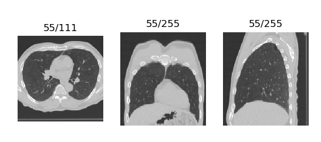

# Working with medical images in Python

**Contents**

* [Installing extra Python packages](#installing-extra-python-packages)
* [Working with 2D image files (i.e. `*.jpg`, `*.png`, `*.tiff`)](#working-with-2d-image-files-ie-jpg-png-tiff)
* [Working with `*.mhd` files](#working-with-mhd-files)
* [Writing `*.mhd` files](#writing-mhd-files)
* [Reading DICOM files with SimpleITK](#reading-dicom-files-with-simpleitk)
    * [Reading 3D DICOM data](#reading-3d-dicom-data)
* [Plotting 3D image files](#plotting-3d-image-files)

In this chapter, a few modules and methods for working with medical images are
discussed. These packages are not included with the Anaconda installation you
(may) have installed previously. Therefore this chapter will also discuss how to install packages in Python.


## Installing extra Python packages

Anaconda comes with the `pip` package manager. You can run `pip` from a Terminal window (on Linux or macOS) or a Command Prompt or Cygwin window on Windows, provided you have added the Anaconda distribution to your PATH during installation. Alternatively, you can open a prompt or terminal from the Anaconda Navigator by clicking on `Environments` in the left side bar, clicking on the green triangle, and then 'Open Terminal'.


In the Terminal, the Windows Prompt, or the Anaconda Terminal, you can use `pip` to install packages. For example, to install the package `SimpleITK`, use

```bash
pip install --user SimpleITK
```

We are going to use SimpleITK to load `*.mhd` and DICOM files later. To be able to read 2D image files, also install the package `imageio` this way. 


## Working with 2D image files (i.e. `*.jpg`, `*.png`, `*.tiff`)

To read and write images we import the `imageio` library. 

```python
import imageio
```

`imageio` supports almost all 2D image formats, such as `jpg`, `bmp`, `gif`, and `tiff`.

You can read any such file on your computer if you supply the path of the image to the `imageio.imread()` function, like this:

```python
my_image = imageio.imread('path/to/image')
```

`my_image` now contains a NumPy array with the intensities of the image. If the file contains a color image, it will be loaded in the format we discussed at the end of the previous section. You can show the image using Matplotlib:

```python
plt.imshow(my_image)
plt.show()
```


---

###### Exercises

1. Load a color image using `imageio`. Make changes to the image array, such that the image becomes a grayscale image. Show the color and grayscale images next to each other. If you can not find an image, you can use the path `imagio:chelsea.png`, which loads one of the example images in `imageio`. 
    
    <details><summary>Answer</summary><p>

    Example code:

    ```python
    color_image = imageio.imread('imageio:chelsea.png')
    grayscale_image = np.mean(color_image[:, :, :3]j, axis=2)
    fig, ax = plt.subplots(1, 2)
    ax[0].imshow(color_image)
    ax[1].imshow(grayscale_image, cmap='gray')  # If you do not use the gray color map, Matplotlib will use its default color map.
    plt.show()
    ```

    </p></details> 

---


## Working with `*.mhd` files

`*.mhd` files are used in Elastix and the ITK software packages. These files can be opened using the SimpleITK package, which is a rather schizophrenic translation of ITK to Python. The functions in this package do *not* adhere to Python conventions. For example, all functions have capitalized camel case names (i.e. `ReadImage` instead of `read_image`).
The following code loads an image from the `example_data` folder in this repository and then retrieves the array of pixel intensities as a NumPy array.

```python
import SimpleITK as sitk
import numpy as np
import matplotlib.pyplot as plt

itk_image = sitk.ReadImage('example_data/chest_xray.mhd')
image_array = sitk.GetArrayViewFromImage(itk_image)

# print the image's dimensions
print(image_array.shape)

# plot the image
plt.imshow(image_array, cmap='gray')
plt.show()
```

`*.mhd` files themselves are pure text header files that contain properties of the images.
For example, for the `chest_xray.mhd` file, the parameters read

```python
ObjectType = Image
NDims = 2
BinaryData = True
BinaryDataByteOrderMSB = False
CompressedData = False
TransformMatrix = 1 0 0 1
Offset = 0 0
CenterOfRotation = 0 0
ElementSpacing = 1 1
DimSize = 1024 1024
ElementType = MET_DOUBLE
ElementDataFile = chest_xray.raw
```

This shows that this chest X-ray is a 2D image, consisting of uncompressed binary data, with 1 mm x 1 mm pixels (`ElementSpacing`) and a size of 1024 by 1024. The `MET_DOUBLE` type will be converted to the `numpy.float64` dtype. SimpleITK image objects like `itk_image` have some methods to get and set these parameters. Because the names of the methods and parameters in the header file *do not match at all*, we give a summary of the most important ones below. Each of the `Get*` methods has a similar `Set*` method to change the parameter, e.g. `itk_image.SetOrigin([1, 0])`.

| Method name      | Accessed `*.mhd` parameter |
| ---------------- | -------------------------- |
| `GetDimension()` | `NDims`                    |
| `GetSize()`      | `DimSize`                  |
| `GetOrigin()`    | `CenterOfRotation`         |
| `GetSpacing()`   | `ElementSpacing`           |
| `GetDirection()` | `TransformMatrix`          |

### Writing `*.mhd` files

You can convert any NumPy array to an ITK image using the `GetImageFromArray()` function. You can write the image to disk using `sitk.WriteImage()`. Before you write the image, you can use the setter methods to change the parameters.

```python
random_data = np.random.rand(100, 100)
random_itk_image = sitk.GetImageFromArray(random_data)
random_itk_image.SetSpacing([1.1, 0.98]) # Each pixel is 1.1 x 0.98 mm^2
sitk.WriteImage(random_itk_image, '/destination/path/for/image.mhd')
```


## Reading DICOM files with SimpleITK

DICOM is the primary format for medical images. Like the `*.mhd`, DICOM splits an image into metadata and raw data. Contrary to `*.mhd` files however, the raw data and the header are in the same file. Almost all vendors of 3D medical imaging hardware use a version of this format. As a consequence, the headers in DICOM files from different manufacturers can deviate extensively.

DICOM files are usually 2D image files. Volumes are stored as folders of 2D DICOM files.

DICOM files can also be read and written using SimpleITK. This requires the same functions that are used for loading `*.mhd` files:

```python
itk_image = sitk.ReadImage('/path/to/dicom/file.dcm')
image_array = sitk.GetArrayViewFromImage(itk_image)
```

for reading, and for writing

```python
new_itk_image = sitk.GetImageFromArray(image_array)
sitk.WriteImage(new_itk_image, '/path/to/new/dicom/file.dcm')
```

DICOM files have header information with a plethora of information on the image you are loading: from simple things like the image size, to the birthdate of the patient or the manufacturer of the scanner. Each DICOM metadata field has a key, which is called a DICOM tag. SimpleITK gives you access to the available tags in the DICOM file using the `GetMetaDataKeys()` method.

```python
print(itk_image.GetMetaDataKeys())
```

```
('0008|0005',
 '0008|0008',
 '0008|0016',
 '0008|0018',
 '0008|0020',
 ...
 '0040|a075',
 '0040|a123',
 '0040|a124',
 '0070|0084',
 '0088|0140')
```

You can use the list of tags [here](https://www.dicomlibrary.com/dicom/dicom-tags/) to see what each tag does. Then, you can get to a specific tag by using the `GetMetaData()` method. For example, if you want to know the manufacturer of the scanner, you need the `(0080, 0070)` tag:

```python
print(itk_image.GetMetaData('0008|0070'))
```
```
'GE MEDICAL SYSTEMS'
```


#### Reading 3D DICOM data

Because 3D DICOM data is distributed over multiple files, one for each slice, you first need to obtain all the filenames.
You can use the built-in Python module `os` to list the filenames in the DICOM directory:

```python
import os
import SimpleITK as sitk

path = '/folder/to/a/3d/volume'
dicom_filenames = os.listdir(path)
```

Then, it is a matter of loading each of those files into a list:

```python
list_of_slices = []
for filename in dicom_filenames:
    dicom_path = os.path.join(path, filename)
    list_of_slices.append(sitk.ReadImage(filename))
```

`list_of_slices` now contains the `FileDataSet` objects, each containing one slice of the volume. To order these, we write a small utility function. We use this function as the sorting key.

```python
def order_by_slice_location(slice):
    return float(slice.GetMetaData('0020|1041'))

list_of_slices.sort(key=order_by_slice_location, reverse=True)
```

Now, the `list_of_slices` is ordered from superior to inferior along the axial direction. Note that we need to set the `reverse` flag to `True` to get this ordering, as the z-coordinate decreases in this direction, and the `list` method `sort()` sorts the list in ascending order without it.

Now, we only need to get the array of pixels in each slice to get the full volume:

```python
volume_list = []
for slice in list_of_slices:
    volume_list.append(sitk.GetArrayViewFromImage(slice)[0])

image_array = np.array(volume_list)
```

`image_array` now contains the 3D volume, which can be plotted or used for further analysis.

## Plotting 3D image files

Once you have loaded your images, you can show (2D slices of) them using Matplotlib:

```python
import matplotlib.pyplot as plt

plt.imshow(your_3d_image[slice_index])
plt.show()
```

However, 3D images can not be easily shown this way. A 3D viewer is included with this educational module in the `code` folder. You can either paste the code in a new file and save it as `scrollview.py` in the same folder as your script, or download the entire repository and copy the `scrollview.py` file to that folder. Then you can import it and us it like this:

```python
import matplotlib.pyplot as plt
from scrollview import ScrollView

fig, ax = plt.subplots()
ScrollView(your_3d_image).plot(ax)
```

You can now use your scroll wheel to move through the slices of the image:



