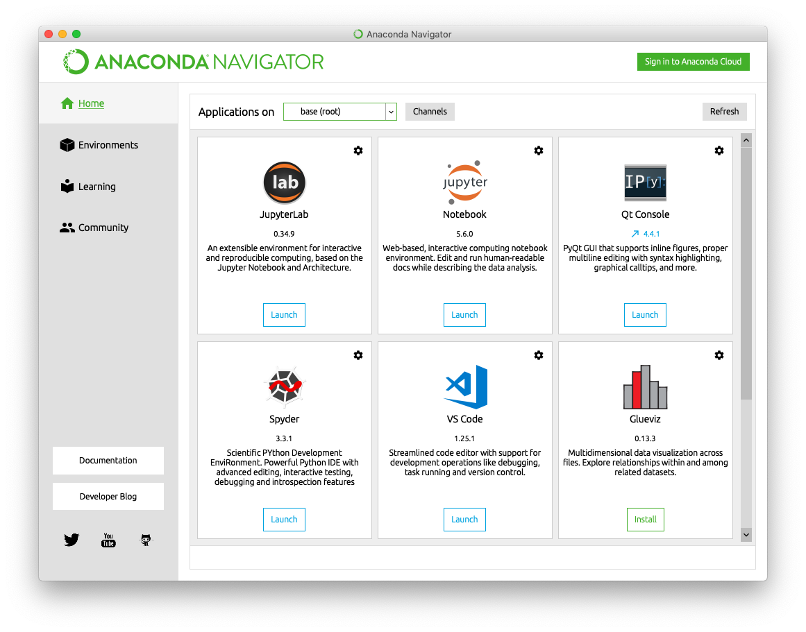
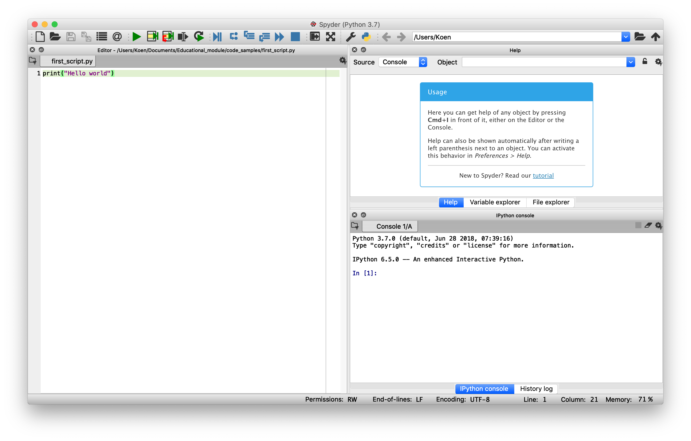
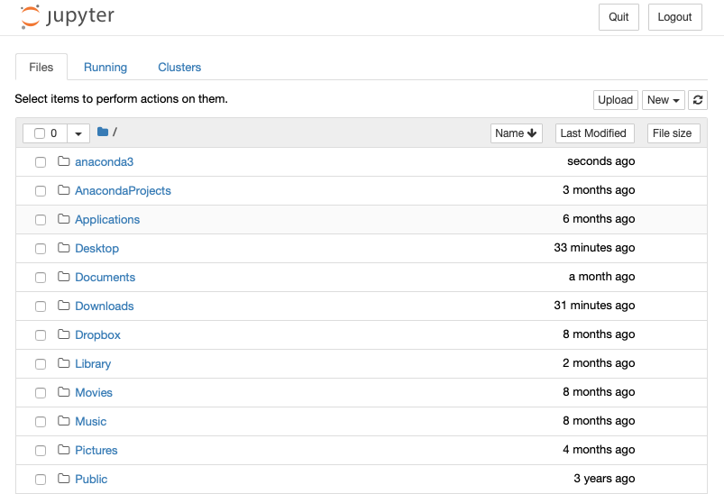
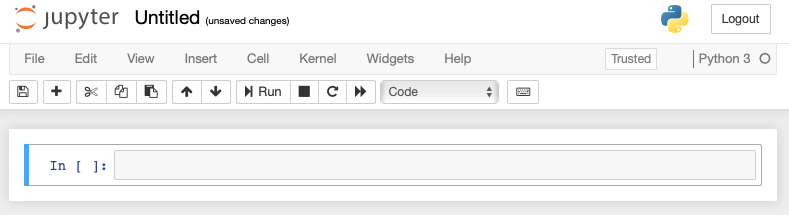
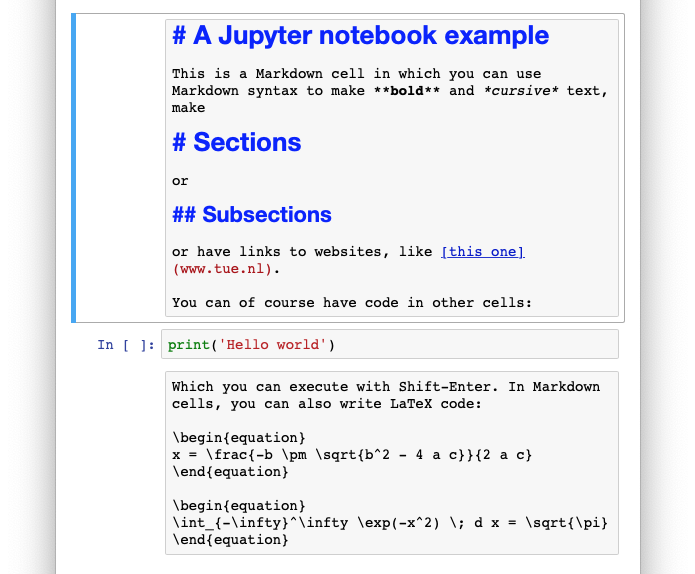
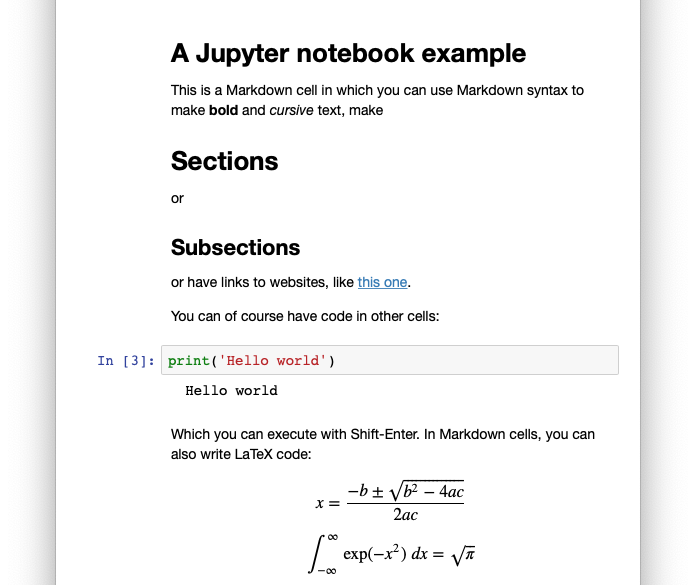

# Python essentials 

**Contents**

* [Getting started](#getting-started)
    * [Installation instructions](#installation-instructions)
    * [Running code](#running-code)
    * [A first script](#a-first-script)
    * [Jupyter notebooks](#jupyter-notebooks)
    * [Errors, warnings, and exceptions](#errors-warnings-and-exceptions)
* [Variables and classes](#variables-and-classes)
* [Operators on numeric variables](#operators-on-numeric-variables)
* [Strings](#strings)
    * [Concatenation](#concatenation)
    * [Converting variables to strings](#converting-variables-to-strings)
    * [Multiline strings](#multiline-strings)
* [Container types](#container-types)
    * [Lists](#lists)
        * [Slicing lists](#slicing-lists)
        * [List functions and methods](#list-functions-and-methods)
    * [String methods](#string-methods)
    * [Tuples](#tuples)
    * [Sets](#sets)
    * [Dictionaries](#dictionaries)
* [Mutability, immutability, and copying](#mutability-immutability-and-copying)
* [Loops and control](#loops-and-control)
    * [For loops](#for-loops)
    * [If, else, elif](#if-else-elif)
    * [While loops](#while-loops)
    * [Breaking out of loops](#breaking-out-of-loops)
    * [Zipping and enumerating](#zipping-and-enumerating)
* [Functions](#functions)
    * [Returning values from functions](#returning-values-from-functions)
    * [Multiple return values](#multiple-return-values)
    * [Named arguments](#named-arguments)
    * [Default arguments](#default-arguments)
* [Classes](#classes)


Python is a high-level programming language that emphasizes readability. Python
code is relatively easy to understand, but it is also very scalable: it is ideal
for small prototypes, but can be used for large complex programs equally well.
Because there are powerful libraries for scientific computation available for
Python, such as NumPy, SciPy, Matplotlib, and TensorFlow, it has become the most
popular programming language for (deep) machine learning and image analysis 
applications, including medical image analysis.

This chapter gives you a crash course in Python. It covers the bare essentials,
and assumes you have some programming experience for scientific computation, for
example in MATLAB. If you have never used Python before, it is useful to try the
examples in this chapter yourself while reading it.

In this module, we will use a particular distribution of Python called
*Anaconda*. This distribution includes some useful packages that we will use,
such as *NumPy* for numerical computation, *Matplotlib* for plotting graphs and
showing 2D and 3D images, and *SciPy* which includes libraries for dealing with
images, statistics, signal processing, optimization, and linear algebra. Later,
we will be installing more packages on top of this.

## Getting started

There is a chance Anaconda is already installed on your computer. If you have a
TU/e laptop, there may be an installation there already. You can check this by
searching for the Anaconda-Navigator. If it does not show up, you need to follow
instructions below. If it does, launch the Spyder app from the navigator, and
check which version of Python is installed in the title bar of the Spyder app.
If it says Python 2.7 or lower, your installation will not be compatible with
the code in this module, and you will need to upgrade by following the
installation instructions below. If it says anything higher than Python 3.0, you
can skip the next section.


### Installation instructions

Go to **anaconda.com** and look for a download button. Make sure you
download the Python 3.7 (or higher) version.

* On Windows and macOS you can simply open the installer and follow the instructions
* On Linux you open the Terminal and navigate to the folder to which you downloaded 
the installer. Change the permissions to enable execution of the installer by
typing `chmod +x Anaconda3-X.sh` where `X` is the rest of the downloaded file's
name. Install by typing `./Anaconda3-X.sh`.

**IMPORTANT: The installer may ask you if you want to add Anaconda to your 
`PATH` environment variable. This means that the Anaconda installation becomes 
the default Python on your system. If you choose no, you will only be able to 
use the Anaconda distribution inside the Anaconda environment, which is 
sufficient to complete this module. If you plan to use Anaconda with a 
different editor than the default one, or if you will be running Python on a server,
it is best to choose yes.**


### Running code

In this section we are going to run code for the first time. The
first step is to fire up the Anaconda navigator. On start-up it should be
showing all applications that come with the Anaconda installation. We will use
this to launch the Spyder editor.


Spyder is an Integrated Development Environment or IDE. It is basically an
editor specifically tailored to writing, running, and debugging Python code.
Of course, you can also write Python code in other editors or IDEs, but for the
purpose of this tutorial, we will use Spyder.



The Spyder window is divided into three panels by default: an editor window on
the left showing the current file, a help panel in the top right, and a console
in the bottom right. You can leave it like that, but it is good to be aware that
other layouts are available in the Window menu in the menu bar.


### A first script

Python programs are often called scripts, which implies that Python is a high-
level language: you don't need much code to be productive. The most simple
program in Python is only one line:

```python
print('Hello world')  # This will print the text string 'Hello world'
```

Not surprisingly, this will use the built-in `print` function to display the
line `Hello world` on the screen. All text after the `#`-sign is a comment that will
be ignored by the Python interpreter. You can use comments to document your
code. In this module, we will also use it to indicate what the result of a line
are. Keep in mind that this is not the intended use of comments in normal
production code.

---

###### Exercises

1. Type the above program in the Spyder editor panel (the left-most panel). Save the file with the extension .py and
run it by clicking on the green 'play' button in the toolbar. If everything is
setup correctly, the IPython console panel on the right should show the printed text.

Should your code take a long time to run and you want to stop the script, click
the button with the red square in title bar of the IPython panel or press <kbd>Control-C</kbd>.

---


### Jupyter notebooks

Instead of running scripts in Spyder or another editor, you can run scripts in so-called
Jupyter notebooks. They are similar to Mathematica's notebooks or MATLAB's Live Scripts: and provide you interactive ways
to run your code in a file format in which you can combine code with text, and even mathematical expressions in LaTeX. They work very well for demonstration purposes and small experiments. For large projects, it is better to use plain '\*.py' files in a text editor like Spyder.

To start Jupyter, click on the Jupyter Notebook icon in the Anaconda Navigator. This will launch the Jupyter notebook interface in your browser. It will probably show your user or home folder first.



From this interface, you can navigate to a folder where you want to save your notebooks. In that folder click the New button at the top right to make a new Python 3 notebook.



You see a first empty 'cell' in which you can type code. In this cell you can write a print statement like the one above. When you want to execute the code in a cell, press <kbd>Shift-Enter</kbd>. From the notebook's menu bar (not the browser's) you can change the type of a cell, in `Cell` -> `Cell type`. You can change the cell type to `Markdown` to write text using the Markdown syntax which you can mix with LaTeX code. When you press <kbd>Shift-Enter</kbd> they are formatted to the marked up text or the actual equations:

Before <kbd>Shift-Enter</kbd>   |   After <kbd>Shift-Enter</kbd>
------    |  ------
 | 

Jupyter notebooks run a so-called Python 'kernel'. Should your script take longer than you hoped, or it crashes altogether, you can always press the stop button (the black square) or the reload kernel button (the rounded arrow next to it) in the toolbar.


### Errors, warnings, and exceptions

Whenever you make a mistake in your code, Python will
display an error message in Spyder's console or in a notebook's cell. Although these error messages can be intimidating,
they usually contain helpful hints about what went wrong and where. For example,
if you try to execute the code `print 'Hello world'`, Python will come back with:

```python
File "script.py", line 1 
print 'Hello world'

SyntaxError: Missing parentheses in call to 'print'. Did you mean print("hello")?
```

In this case, it is clear that you forgot the parentheses. It will also point
out where it found the mistake: at the end of the string in line 1 of your
script. This is useful when your script is several hundreds of lines long. We
will come back to error messages a few times in this module, because
understanding them is essential to writing scripts. In general, keep in mind
that the error messages Python gives are actually useful in your quest for a
working script. And if you still do not understand what is wrong, the chance is
high someone on StackOverflow or Reddit has already figured it out.

Error messages are also called 'Exceptions' in Python because they deal with
'exceptional conditions'.

Some Python libraries (more on those later) can also display warnings. These
are there to warn you of less than ideal conditions of your code. For example,
a warning message may say that the code is unnecessarily slow, or that the functions
or classes (more on those later as well) you are using have been deprecated: they
will be removed in future versions of the library and you should stop using them.
Warnings will not stop your code from running, but it may be wise to understand
what they are about to make sure your code is in good shape. Again, looking up
the warning online is the best start of understanding what is going on.


## Variables and classes

In Python, variables are declared and defined in one line. You never have to
specify the class of a variable because Python will be smart enough to figure
that out. Therefore, whether you are defining integer, string, decimal, or
boolean values, the syntax for defining a variable is always the same:

```python
a = 9
b = 'Some string'
c = 1.23
d = True
```

Each of these four variables has their own respective class, namely `int` for
integer values, `str` for text strings, `float` for decimal values, and `bool`
for the boolean values True and False. You can show the class of a variable
using the built-in `type()` function:

```python
print(type(a), type(b), type(c)) # Prints "<class 'int'> <class 'str'> <class 'float'>".
```

You are free to choose your own variable names. It is however convention to only
use lower case letters, numbers and underscores in variable names, so it is
preferred to use `my_awesome_variable` over `myAwesomeVariable`. There is an
exception for variables that contain the same value throughout running your
program: they should be capitals to show they should not be changed. They can be
used for mathematical constants or to communicate constraints or parameters in
your code, for example

```python
PI = 3.14159
MAX_VALUE = 100
```

## Operators on numeric variables

Numeric variable types include `int` for integers and `float` for decimals. To
be complete we are also mentioning the type `complex`, which can represent
complex values, for example
    
```python
c = 3 + 4j
```

We will not discuss them in the remainder of this document, as they are rarely
used.

The numeric types can be used with standard mathematical operators for
computation. You can add (`+`), subtract (`-`), multiply (`*`), and divide (`/`)
them, and use exponentiation (`**`). The order of operations is

* Exponentiation
* Multiplication
* Division
* Addition
* Subtraction

Using parentheses you can force a different order, such that `(1 + 2) * 3` will
result in `9` and `1 + 2 * 3` will result in `7`. Nothing special there.

There are some caveats in the types that are returned by these operators. This
is a frequent source of bugs, so be careful.

* Exponentiation, adding, multiplying, and subtracting integers will return an integer, i.e. `2 ** 3 + 1 + 2 * 3` returns `15`.
* Exponentiations, additions, multiplications, and subtractions containing *at least one* `float` will return a `float`, i.e. `2 ** 3 + 1.0 + 2 * 3` returns `15.0`, not `15`. 
* Division *always* returns a `float`, i.e. `10 / 5` returns `2.0`, not `2`. To ensure the result of a division is rounded down to an integer, you can use the special integer division operator `//` i.e. `10 // 5` will return `2`. It will always round *down* to the closest integer.
* Division by 0 will result in a `ZeroDivisionError` which will stop your program if you do not take care to solve it.
* By default, there is no square root operator. You can use the power operator for this, i.e. `9 ** 0.5` returns `3.0`, or you can import a library that has a square root function, which is dicussed in the [module on SciPy](numpy-scipy-matplotlib.md).

You can also check equality and inequality of numeric variables, using the
operators `==` and `!=`. These will return a boolean value, i.e. `True` or
`False`. Similarly, you can test if numbers are larger than, smaller than,
larger than or equal, and smaller than or equal using the operators `>`, `<`,
`>=`, and `<=`.

```python
1 + 2 + 3 > 6  # gives False
1 + 2 + 3 >= 1  # gives True
1 + 2 + 3 != 6  # gives False
```

Finally, you can use the modulus operator `%` to find the remainder of a
division. `a % b` is a shorthand for `a - (a // b)`, for example `8 % 2` equals
`0` and `8 % 3` equals `2`, etc. This is convenient to see if an integer is
divisible by another integer, because if that is true, the remainder of that
devision will be zero.


---

###### Exercises

* Write a script that prints the square root of the integer 17. What class is the resulting value? Why?
    
    <details><summary>Answer</summary><p>

    ```python
    x = 17
    result = x ** 0.5
    print(result)  # 4.123105625617661
    print(type(result))  # <class 'float'>
    ```

    The type of the result is a float, because the exponent is a float.
    </p></details>

* What error do you get when you run `print(81 + 'Forty-two')`? Can you explain the name of the error?

    <details><summary>Answer</summary><p>
    This will result in a `TypeError: unsupported operand type(s) for +: 'int' and 'str'`: the types of the two things you are trying to add are not supported by the `+`-operator.
    </p></details>

* What is the result of the calculation `2 ** 3 / 2 + 8`? What is the type? Why?
    
    <details><summary>Answer</summary><p>
    The order in which this is calculated is `2 ** 3 / 2 + 8 = 8 / 2 + 8 = 4.0 + 8 = 12.0`. The result is a `float` because there is a normal division in the computation.
    </p></details>

---


## Strings 

Strings are any text between single (`'`) or double (`"`) quotation marks. By
convention, we will only use single quotation marks for string definitions.

Strings can contain character combinations that have special meaning,
for example, '\n' which is a newline character, and '\t' which is a tab. You can use
these as follows

```python
s = 'This is a very long sentence that is so long that it will\nnot fit on one line.'
t = '\tThis line starts with a tab. \t See?'
```

If you print these strings, you get

```python
This is a very long sentence that is so long that it will
not fit on one line.
```

and

```python
    This line starts with a tab.     See?
```

### Concatenation

Somewhat surprisingly, strings can be concatenated (joined) with the `+`-operator:

```python
a = 'abc'
b = 'def'
c = a + b
print(c)  # prints "abcdef"
```

Likewise, strings can be multiplied with a scalar value, i.e. `9 * 'la' + ' can\'t hear you'` results in `lalalalalalalalala can't hear you`. The back-slash in the middle of `can\'t` is there to print a `'` because `'` is also used to surround string values.

### Converting variables to strings

Other types can be converted to strings using the built-in `str`-function:

```python
print('The square root of ' + str(1024) + ' is ' + str(32) + '.') # prints "The square root of 1024 is 32.""
```

There is a nicer way to do this, by using so-called format strings, which have
place holders for other variables. This uses the `str`-type's `format` method to
fill-in the place holders. The place holders are indicated with \{\}:

```python
print('The square root of {} is {}'.format(1024, 32)) # prints "The square root of 1024 is 32."
```

The format string syntax is very powerful. One useful feature is the ability to
truncate floating-point values to a specific precision, for example to three decimals:

```python
print('{:.3f}'.format(1.618033989))  # prints "1.618"
```

The remaining details on this syntax are beyond the scope of this module, but
can be found online at [https://docs.python.org/3/library/string.html#formatstrings](https://docs.python.org/3/library/string.html#formatstrings).


### Multiline strings

If you want to display a lot of text, you can use three quotation marks to indicate that a string will span multiple lines in your script, for example

```python
long_text = """Lorem ipsum dolor sit amet, consectetur adipisicing elit,
sed do eiusmod tempor incididunt ut labore et dolore magna aliqua. Ut
enim ad minim veniam, quis nostrud exercitation ullamco laboris nisi
ut aliquip ex ea commodo consequat. Duis aute irure dolor in reprehenderit
in voluptate velit esse cillum dolore eu fugiat nulla pariatur. Excepteur
sint occaecat cupidatat non proident, sunt in culpa qui officia deserunt
mollit anim id est laborum."""
```

If you print this variable, you will notice that it treats the line breaks literally, and you do not have to include any `\n` characters.


---

###### Exercises

Given the following code
    
```python
x = 81
y = 23
```

* Write a third line that uses a format string and the variables `x` and `y` to print '81 plus 23 equals 104'
    <details><summary>Answer</summary><p>

    ```python
    print('{} plus {} equals {}'.format(x, y, x + y))
    ```
    
    </p></details>

* Write a fourth line that uses a format string and the variables `x` and `y` to print '81 divided by 23 equals 3 with a remainder of 12'
    <details><summary>Answer</summary><p>
    
    ```python
    print('{} divided by {} equals {} with a remainder of {}'.format(x, y, x // y, x % y))`
    ```
    
    </p></details>

---

## Container types

In addition to the string and number types we have seen in the previous
sections, Python has container types that allow you to assign collections of
data to a single variable. These types are `list`, `tuple`, `dict` (short for
dictionary), and `set`. In fact, strings are also collections (they are sequences of letters), so we also discuss the consequences of that in this section.


### Lists

Lists can contain any combination of types. To define a list `countries` that
contains the strings `"The Netherlands"`, `"Belgium"`, `"Luxembourg"` you can
type:

```python
countries = ["The Netherlands", "Belgium", "Luxembourg"]
```

Lists can also contain mixed types:

```python
numbers = ["one", 2, "three", 4.0, 5, "six", 7, "EIGHT", 'nine', "10.0"]
```

Lists can be 'indexed', that is, you can retrieve items from the list using the
index of that item. Items start at 0, such that `best_country = countries[0]`
will result in the variable `best_country` containing `"The Netherlands"`, and
`numbers[3]` will return `4.0`. 

Lists are also *mutable*, which means we can change the contents of an item in the list by index, for example we can change the eighth item in the list to Roman numerals using:

```python
numbers[7] = 'VIII'
```

which will result in `numbers` now containing `["one", 2, "three", 4.0, 5, "six", 7, "VIII", 'nine', "10.0"]`.


##### Slicing lists
The index syntax can also be used to *slice* lists, that is, create "sub lists" from an existing list. For example, to get to the first four numbers, from the list that we defined before, we can type

```python
small_number = numbers[0:4]
```

Here `:` slices the array from index 0 to (but not including!) index 4. We can also define a step size when slicing a list:

```python
odd_numbers = numbers[0:8:2]
```

where the `2` at the end specifies that we should take every second item. The slicing operator takes the form `start_index:end_index:step_size`.   

An overview of the slicing syntax is given in the following table:

| syntax            | meaning                                           | result                                                        |
| ---               | ---                                               | ---                                                           |
| `numbers[0:4] `   | the first four items                              | `["one", 2, "three", 4.0]`                                      |
| `numbers[:4] `    | the same as `numbers[0:4]`                        | `["one", 2, "three", 4.0]`                                      |
| `numbers[-1] `    | the last item in the list                         | `"10.0"`                                                        |
| `numbers[3:]`     | from the fourth item to the last item of the list | `[ 4.0, 5, "six", 7, "VIII", 'nine', "10.0"]`                   |
| `numbers[:] `     | all items of the list, i.e. the same list         | `["one", 2, "three", 4.0, 5, "six", 7, "VIII", 'nine', "10.0"]` |
| `numbers[0:4:2] ` | every second item of the first four numbers       | `["one", "three"]`                                              |
| `numbers[3::2] `  | every second item starting at the fourth item     | `[4.0, "six", "VIII", "10.0"]`                                  |
| `numbers[::2] `   | every second item                                 | `["one", "three", 5, 7, 'nine']`                                |

The slicing syntax can also be used to *set* values in a list, for example

```python
l = ['a', 'b', 'c', 'd']
l[:2] = ['x', 'y']  # l now contains ['x', 'y', 'c', 'd']
```

Be careful, as the results may be unexpected if you do not supply the same number of items. The fact that the following code does not give an error may surprise you:

```python
l = ['a', 'b', 'c', 'd']
l[:2] = ['x', 'y', 'z']
```

It is therefore best to always match the length of the lists on both sides of the `=`-sign.


##### List functions and methods

Like strings, lists can be concatenated using the `+`-operator:

```python
a = [1, 2, 3]
b = [4, 5, 6, 7]
c = a + b
```

In principle, you can use the same syntax to add an item to an existing list:

```python
l = [1, 2, 3]
l = l + [4]  # l now contains [1, 2, 3, 4]
```

However, this is very slow for large lists (Python first has to retrieve the list from memory, concatenate it with that one item, and then put it back), and there is a much faster solution, using a list *method* called `append()`, which looks like this:

```python
l = [1, 2, 3]
l.append(4)  # l now contains [1, 2, 3, 4]
```

A method is a function associated with a specific type of variable, in this case lists. A method can have arguments, in this case the 4. The syntax above means 'apply the `append` method with the argument `4` to the list variable `l`'. Other list methods include `index`, which shows the index of a specific item, and `count()`, which counts how many times an item occurs in a list:

```python
l = [1, 1, 2, 3, 2, 3, 3, 3, 1]
l.count(1)  # Counts how many times 1 occurs in list l
l.index(2)  # Gives the index of the first occurrence of 2 in l
```

We can also insert or remove items from the list using list methods. The `insert()` method can insert an item at a specific index, while the `remove()` method looks for the first occurrence of an item and removes it from the list. The `pop()` method removes (and returns) the last item of the list.

```python
l = ['one', 'two', 'four']
l.insert(2, 'three')  # l now contains ['one', 'two', 'three', 'four']
l.remove('two')  # l now contains ['one', three', 'four']
v = l.pop()  # l now contains ['one', three'], v contains 'four'
```

Note that the behavior of `l.insert(2, 'three')` is different from `l[2] = 'three'`. In the first case the list grows by one item, while the second case just replaces an item.
Likewise there are methods to reverse and sort the list *in place*: 

```python    
l = ['b', 'c', 'a']
l.reverse()
print(l)  # prints ['a', 'c', 'b']
l.sort()
print(l)  # prints ['a', 'b', 'c']
```

By default, the `sort()` method sorts strings alphabetically. A list of numbers is sorted ascendingly by default.

Finally, there is a *function* (not a method!) that is very useful when working with lists and strings, called `len()` that gets you the length:

```python
l = ['a', 'b', 'c']
print(len(l))  # prints 3
s = 'abcdef'
print(len(s))  # prints 6
```

### String methods

Strings also have methods, including some of the list methods discussed in the previous section. However, strings are *immutable*: you can not change them. You can use all the list methods that read from lists (e.g. `count()`, `index()`, and the `len()` function) also on strings, but not the methods that *change* lists (`append()`, `insert()`, `remove()`, `pop()`).

In addition to the `count()` and `index()` methods, and the `format()` method we have seen before, there is also a `split` method, that can split a string into chunks:

```python
s = 'abcabcab'
l = s.split('c')  # l contains ['ab', 'ab', 'ab']
```

or more useful

```python
sentence = 'The quick brown fox jumped over the lazy dog'
words = sentence.split(' ')
```

and a `find` method, that returns the index of the first occurrence of a series of characters in a string:

```python
sentence = 'The quick brown fox jumped over the lazy dog'
sentence.find('jumped')  # returns 20
```

We can also slice strings:

```python
print(sentence[:20])  # prints 'The quick brown fox '
```

### Tuples

Tuples are similar to lists, but are immutable. Instead of the square brackets, you use parentheses to define them:

```python
my_first_tuple = (1, 2, 2, 'a', 'b', 3)
```

Tuples are mostly used for sequences that are guaranteed to be constant. We will see them return later in the section on functions. For now, be aware that you cannot assign to them, i.e.

```python
my_first_tuple[3] = 'Aardvark'
```
gives a `TypeError`, because the tuple type does not support indexing and slicing. The `list`-methods and functions that do not mutate are applicable to tuples as well, including indexing and slicing, the `len()` function, and the `count()` and `index()` methods.


### Sets

Python's sets are similar to sets in mathematics: they are sequences of unique items. They are rarely used, but it is good to know they exist. They are defined with curly braces:

```python
a_set = {1, 2, 3, 'a'}
```

Because all items in a set are unique, it is useless to add the same item more than once. The following definition results in the same set as the one above:

```python
a_set = {1, 2, 3, 'a', 'a', 'a', 'a'}
```
For the same reason, the `count` method is not supported, and the `index` method is not supported for the reason that `set`s do not care about the order of their contents.

Sets support the `remove()` method, and an `add()` method (not append!) to add a new item to a set. You can use the `set()` function to turn a list or tuple into a set of unique items:


```python
print(set([1, 1, 2, 3, 3, 3]))  # prints {1, 2, 3}
```

Adding values that already are in the set has no effect.


### Dictionaries

Finally, Python has a dictionary type called `dict`. A `dict` maps keys to values, like an English dictionary maps words to descriptions. You could actually define an English dictionary using the curly brace dictionary syntax:

```python
my_dictionary = {
    'aardvark': 'a nocturnal badger-sized burrowing mammal of Africa, with long ears, a tubular snout, and a long extensible tongue, feeding on ants and termites.',
    'aardwolf': 'a black-striped nocturnal African mammal that feeds mainly on termites.',
    'abaca': 'a large herbaceous Asian plant of the banana family, yielding Manila hemp.',
}
```

Instead of by index, you retrieve items from the dictionary using the keys, for example

```python
my_dictionary['abaca']
```

You can also add or change items using this syntax:

```python
my_dictionary['aback'] = 'towards or situated to the rear; back'
my_dictionary['aardvark'] = 'an eclectic big band founded in 1973'
```

Dictionaries have two important methods to retrieve the keys and values:

```python
print(my_dictionary.keys())  # prints 'dict_keys(['aardvark', 'aardwolf', 'abaca', 'aback'])'
```
You can probably predict what the `values` method does now.

The `dict_keys` and `dict_values` type can be converted to a list using the list constructor function:

```python
print(list(my_dictionary.keys()))  # prints '['aardvark', 'aardwolf', 'abaca', 'aback']'
```

Dictionaries also support the `pop()` method that removes a value by key, i.e.:

```python
d = {'a': 1, 'b': 2, 'c': 3}
v = d.pop('b')  # v now contains 2, d is now {'a': 1, 'c': 3}
```


---

###### Exercises

* Are `dict`s mutable or not?
    <details><summary>Answer</summary><p>
    Yes they are, as there are ways to change, add, or remove the values in a dictionary, e.g. by assigning at a specific index, or by using the `pop`-method.
    </p></details>

* Given `my_dictionary` as given above, write code that takes the second description, and prints the individual words of the description in reverse order.
    <details><summary>Answer</summary><p>

    ```python
    key = list(my_dictionary.keys())[1]
    desc = my_dictionary[key]
    words = desc.split(' ')
    words.reverse()
    print(words)
    ```

    The last two lines can also be replaced by `print(words[::-1])`.
    </p></details>

---


## Mutability, immutability, and copying

As we have seen before, `list`, `set`, and `dict` are mutable types: you can change elements of them after defining them:

```python
l = [1, 2, 3]
l[2] = 100   # l is now [1, 2, 100]
```

On the other hand, types like `tuple` and `str` are not mutable: you have to re-assign them to change them, i.e. this does not work:

```python
s = 'abc'
t = (1, 2, 3)

...

s[0] = 'd'  # This will result in an error.
t[0] = 42   # This will result in an error.
```

Instead, you would need to explicitly re-assign the values for `s` and `t`:

```python
s = 'abc'
t = (1, 2, 3)

...

s = 'dbc'
t = (42, 2, 3)
```

Mutable values are assigned to *by reference*. To explain what this means, let's look at an example. If you assign a list to a variable `l`, like this:

```python
l = [1, 2, 3]
```

`l` actually contains a list with *references* to where the numbers 1, 2, and 3 are stored in memory. Basically, `l` is not a list of numbers, but a list of *addresses* in memory where the numbers are stored.
When you make a copy of the list, by doing

```python    
m = l
```

you are *not* copying the numbers, but the addresses. When you change a list, for example by assigning a new number to an element of the list

```python
l[1] = 100
```

not the element itself get changed, but the number at that address in memory is changed. This has the consequence that

```python
print(m[1])
```

will now also print `100`, because `l[1]` and `m[1]` both contain the same address, and we have changed the number at that address to `100`. This is illustrated in the diagram below, where the addresses are drawn as arrows.


## Loops and control

### For loops

For loops in Python are relatively simple: you can only apply them to sequences. If you need a for loop, you need some kind of sequence (like a list, tuple, string, dictionary, or set) to loop over. Always. For loops can therefore be used to apply something to all items in a list, for example printing them:

```python
l = ['ONE', 'TWO', 'THREE', 'FOUR']
for item in l:
    print(item)
```

This will invoke the print function on every item in the list. Every iteration of the loop it will assign one item from the list to the variable `item`, which it will print. Note the `:` at the end of the for-statement. This is important, as it signifies that a new block of code starts. This new block is indented, not by convention, but as a rule! The code will not run if you do not do this correctly.

The name `item` is just an arbitrary placeholder name. You can use any name, as long as you do it consistently. For example,

```python
for number in l:
    print(number)

for a in l:
    print(a)
```

all do the same.

Sometimes, you want to perform the same task a fixed number of times. For this purpose you can use the `range()` function. A range returns a sequence between two numbers, with a certain step size, for example `range(0, 10, 2)` denotes every second number between 0 and (but not including) 10. You can use ranges in combination with for loops:

```python
for x in range(0, 10, 2):
    print(x)
```

If you only supply the range function with two arguments, it will assume a step size of 1. If you only supply one argument, it will assume that it should start at 0, hence

```python
for i in range(3):
    print(i)
```

will print 0, 1, and 2 on separate lines.


---

###### Exercises

* Write code that computes the sum of an arbitrary list of numbers, for example the list `l = [1, 2, 3.0]`

    <details><summary>Answer</summary><p>

    ```python
    sum = 0
    for value in l:
        sum = sum + value
    print(sum)
    ```

    </p></details>

* The factorial of a positive integer n, denoted by n!, is the product of all positive integers (i.e. larger than zero) less than or equal to n. For example, 5! = 5 * 4 * 3 * 2 * 1. Use a for loop to compute the factorial of 15.

    <details><summary>Answer</summary><p>

    ```python
    factorial = 1
    for i in range(1, 16):
        factorial = factorial * i
    ```

    </p></details>

---


### If, else, elif

Python has an if-else construct for conditionals. Like the for loop syntax, it follows an indented block structure, where each line before a block ends in a colon `:`. It looks like this:

```python
if condition:
    # Execute this code if condition equals true
else:
    # Execute this code otherwise
```

For example, given a number `x` we can check if it is even or odd:

```python
if x % 2 == 0:
    # x is even, because there is no remainder after division by 2
    print('x is even')
else:
    print('x is odd')
```

The else block is optional:

```python 
l = [1, 2, 3]
if len(l) > 10:
    print('List is full!')
```

Sometimes, you want to check for multiple conditions. Then you can use the elif statement. For example, if we first want to check if a list is empty before checking how many items it is 'full', we can do this:

```python
if len(l) == 0:
    print('List is empty')
elif len(l) < 10:
    print('List contains fewer than 10 items')
else:
    print('List contains 10 items or more')
```

You can add as many `elif` statements between the `if` and `else` as you want. You can also nest if blocks, by indenting once more, i.e.:

```python
if condition1:
    if condition2:
        print('both true')
    else:
        print('only 1 is true')
else:
    if condition2:
        print('only 2 is true')
    else:
        print('both false')
```

However, this would be equal to:

```python
if condition1:
    if condition2:
        print('both true')
    else:
        print('only 1 is true')
elif condition2:
    print('only 2 is true')
else:
    print('both false')
```

You can combine multiple conditions using the `and` and `or` keywords, for example:

```python    
if condition1 and condition2:
    print('both are true')

if condition1 or condition2:
    print('at least one of the conditions is true')
```

There are special conditionals to check if an item is in a list, or a letter is in a string, using the keyword `in`:

```python
the_list = [1, 2, 3, 9, 0]

if 9 in the_list:
    print('Yes, 9 is in the list')
```

### While loops

While loops combine the idea of repeating tasks with conditionals. The syntax is as follows:

```python
while `condition`:
    # This code will repeat until the condition is NOT true any more.
```

for example,

```python
x = 0
while x < 10:
    x = x + 1
    print(x)
```

will add one to x and print x until x equals 10.

If the condition is never met, the loop will run forever, so be careful to define your conditions well. If this should ever happen, remember that Spyder and Jupyter have a stop button to force your script to stop. You can also press Ctrl-C to stop your script in Spyder.

In machine learning, you will not often need a while loop, and it is better to use for loops whenever possible.


### Breaking out of loops

Sometimes, it is better to stop looping once a secondary condition is met. You can do this doing the break statement. For example:

```python
for i in range(n):
    if condition:
        break
```

### Zipping and enumerating

Sometimes, you have two lists that you want to iterate over in parallel. You can zip them together using the `zip`-function:

```python
english = ['one', 'two', 'three', 'four', 'five', 'six', 'seven']
italian = ['uno', 'due', 'tre', 'quattro', 'cinque',
    'sei', 'sette', 'otto', 'nove', 'dieci']
roman_numerals = ['I', 'II', 'III', 'IV', 'V', 'VI', 'VII']

for i, j, k in zip(english, italian, roman_numerals):
    print(k, i, j)
```

Sometimes it may be useful to know the index of the items you iterate over. There are two options then:

```python
for i in range(len(roman_numerals)):
    print(i, roman_numerals[i])
```

Or more elegantly

```python
for i, x in enumerate(roman_numerals):
    print(i, x)
```

Or even combine them:

```python    
for i, (x, y, z) in enumerate(zip(english, italian, roman_numerals)):
    print(i, x, y, z)
```


---

###### Exercises

* Write code that checks for each number between 0 and 100 if it is divisible by 3. If so, print this number if it is also divisible by 5 or 7.

    <details><summary>Answer</summary><p>

    ```python
    for i in range(101):
        if i % 3 == 0:
            if i % 7 == 0 or i % 5 == 0:
                print(i)
    ```

    </p></details>

* A prime number is a number larger than 1 that is only divisible by 1 and itself. Write code to check if 12829 is prime.

    <details><summary>Answer</summary><p>

    ```python
    x = 12829
    for i in range(2, x):
        if x % i == 0:
            print('No, {} is not a prime number'.format(x))
            break  # We may as well stop this loop now...
    print('Finished')
    ```

    If this prints 'Finished' before printing 'No', `x` is a prime number.
    </p></details>

---


## Functions

So far, all code that we have written has been run linearly: the Python interpreter starts interpreting your code from the start of you .py-file, except for loops where it sometimes executes parts multiple times, and conditional statements, where it may skip some lines, depending on the context. While this is relatively easy to understand for the small problems we have used so far, it becomes difficult for larger programs. It is best to *compartmentalize* some code into functions, that can implement functionality that can be reused multiple times, are easy to test and provide structure to your code.

We already have seen some of Python's built-in functions pop-up here and there: `print`, `type`, `len`, `enumerate`, `zip`, `range`, `list` are all functions. Functions can have any number of arguments, sometimes a certain number is required: `print` is happy even with no arguments at all, `type`, `len`, and `list` will only except one argument, whereas `range` excepts one, two, or three arguments.

You can write your own functions using the `def` keyword. For example:

```python
    def my_first_function():
        print('Hello world')
```

You can call (run) this function by typing `my_first_function()` in the console, or below the function definition. If you do not do that, the function will still be defined, it is just not used.
This function has zero arguments: the sequence of arguments between the parentheses is empty.

Functions can have arguments that can be used in the function's body, for example:

```python
    def greet(name):
        print('Hello {}'.format(name))
```

Which you can call like this:

```python
    greet('you')  # This will print 'Hello you'
```

`name` has become a placeholder variable, but this variable can have an arbitrary name, i.e.

```python
    def greet(someone):
        print('Hello {}'.format(someone))
```

has the same effect.

#### Returning values from functions

Functions like the `len`-function return a value, i.e. 

```python
    list_length = len(the_list)
```

results in the variable `list_length` to contain an integer value.

Your own functions can return values using the `return` keyword, for example

```python
    def add(n1, n2):
        sum = n1 + n2
        return sum
```

The function stops after the `return` keyword, so any code after it will not be executed:

```python
    def add(n1, n2):
        sum = n1 + n2
        return sum
        print('This will not be printed')

    print(add(1, 2)) # This will be printed.
```


---

###### Exercises

* Write a function that takes two lists as arguments, and returns the inner product of the list. The inner product is the sum of the element-wise products of the list. Test your code by calling it with two lists of floats.

    <details><summary>Answer</summary><p>

    ```python
    def inner_product(l1, l2):
        sum = 0
        for a, b in zip(l1, l2):
            sum = sum + a * b
        return sum

    print(inner_product([1.0, 2.0, 3.0], [4.5, 3.2, 0]))  # Should print 10.9
    ```

    Alternatively:
    ```python
    def inner_product(l1, l2):
        sum = 0
        for i in range(len(l1)):
            sum = sum + a[i] * b[i]
        return sum

    print(inner_product([1.0, 2.0, 3.0], [4.5, 3.2, 0]))  # Should print 10.9
    ```
    
    </p></details>

* Expand the function by adding a check if the lists are the same size. If not, print a warning. Test it on two lists of different length.

    <details><summary>Answer</summary><p>

    ```python
    def inner_product(l1, l2):
        if len(l1) == len(l2):
            sum = 0
            for a, b in zip(l1, l2):
                sum = sum + a * b
            return sum
        else:
            print('Input lists are different in length.')
    ```

    Alternatively, this also works

    ```python
    def inner_product(l1, l2):
        if len(l1) == len(l2):
            sum = 0
            for a, b in zip(l1, l2):
                sum = sum + a * b
            return sum
        print('Input lists are different in length.')
    ```

    If the lists are the same length, the print-function will not be called.
    </p></details>

* Write a function called `unique()` that takes a list as argument, and returns a new list containing all unique values in the list.

    <details><summary>Answer</summary><p>

    ```python
    def unique(l):
        m = []
        for x in l:
            if x not in m:
                m.append(x)
        return m
    ```

    or exploiting sets:

    ```python
    def unique(l):
        s = set(l)
        m = list(s)
        return l
    ```
    </p></details>

---


#### Multiple return values

Of course, you can also return lists, sets, tuples, or dictionaries from functions. For example, you could create a function that adds the elements of two lists:

```python
    def translate_point(translation, point):
        new_point = []
        for a, b in zip(translation, point):
            new_point.append(a + b)
        return new_point
```

You can also use this functionality to return multiple values, for example,

```python
    def swap_values(a, b):
        return [b, a]
```

The call to this function can implicitly unpack the a and b variables:

```python
    [x, y] = swap_values(1, 2)  # now x = 2, y = 1
```

In fact, you can have multiple return values, like this too:

```python
    def swap_values(a, b):
        return b, a

    x, y = swap_values(1, 2)
```

---

###### Exercises

* Write a function that takes a circle's radius as its argument and returns the circle's surface area and circumference. Call the function to check if it works.

    <details><summary>Answer</summary><p>

    ```python
    PI = 3.141592654


    def circle(radius):
        area = PI * radius ** 2
        circumference = PI * radius * 2
        return area, circumference


    a, c = circle(10)  # Should return ~314, ~62.4
    ```

    </p></details>


* Write a function that takes two strings as its arguments and returns True if any of the letters in the first string occur in the second string, and False if not.

    <details><summary>Answer</summary><p>

    ```python
    def string_overlap(s1, s2):
        for letter in s1:
            if letter in s2:
                return True  # Once we find one letter that is
                             # also in the second string we can stop looking.
        return False
    ```

    </p></details>

* Write a function that returns True if a number is prime, and False otherwise.
    
    <details><summary>Answer</summary><p>

    ```python
    def is_prime(x):
        if x < 2:
            return False
        for i in range(2, x):
            if x % i == 0:
                return False
        return True
    ```

    </p></details>

* Write a function that returns a list of all primes smaller than N, where N is an argument to the function. Use the function you wrote in the previous question.
    
    <details><summary>Answer</summary><p>

    ```python
    def primes_up_to(n):
        l = []
        for i in range(2, n):
            if is_prime(i):
                l.append(i)
        return l
    ```

    </p></details>

* Write a function that replaces all values in a list with 0.

    <details><summary>Answer</summary><p>

    ```python
    def replace_values(l):
        for i in range(len(l)):
            l[i] = 0
    ```

    Remember that assignments to lists are *by reference*. It is not necessary to return `l` from the function.
    </p></details>

---


#### Named arguments

In the case of the `translate_point` function we have seen before 

```python
    def translate_point(translation, point):
        new_point = []
        for a, b in zip(translation, point):
            new_list.append(a + b)
        return new_point
```

it is not quite clear which argument is the translation vector, and which one is the point when you call it. Luckily, you can call a function while explicitly naming the arguments:

```python
    new_point = translate_point(translation=[1, 2], point=[3, 4])
```

This helps you distinguish the arguments, and helps to let you figure out which argument goes where. In fact, you are allowed to change the order when you name the arguments, such that

```python
    new_point = translate_point(point=[3, 4], translation=[1, 2])
```

would be equivalent. This is especially useful when you have functions with a lot of arguments, and you do not want to have to scroll back to the function definition.


#### Default arguments

Function arguments can be defined as optional if they have a default value in their definition, for example,

```python
def greet(name='stranger'):
    print('Hello {}'.format(name))
```

can now be called as

```python
greet()
```

upon which it will print 'Hello stranger', or as

```python
greet('you')
```

upon which it will print 'Hello you'.

A particular application of this functionality is debugging. If you have a complex function that is hard to program, you could include a `debug` flag as an argument in your function, that you put to `False` by default. When `debug` is set to `True`, the function will print messages to show what it does:

```python
def is_prime(k, debug=False):
    for i in range(2, k):
        if k % i == 0:
            if debug:
                print('{} is divisible by {}'.format(k, i))
            return False
        elif debug:
            print('{} is not divisible by {}'.format(k, i))
    return True
```

Now, running `is_prime(56, debug=True)` will print that 21 is not divisible by 2, 3, 4, 5, and 6, but is divisible by 7, whereas `is_prime(56)` will not.

---


###### Exercises

* Write a function called `root()` that will compute the square root of the first argument `k`. It should have an optional argument `order` that specifies the order of the root. In the that the order is odd, and `k` is negative, the root does not exist, and the function should print an error message.

    <details><summary>Answer</summary><p>

    ```python
    def root(k, order=2):
        if order % 2 == 0:
            if k < 0:
                print('Invalid computation: negative'
                      ' argument of {}-order root.'.format(order))
                return
        return k ** (1 / order)
    ```

    </p></details>

---


## Classes

So far we have seen a few built-in variable types or *classes*: `int`, `float`, `complex`, `str`, `list`, `set`, `dict`, and `tuple`. A *class definition* describes how a variable of a certain class *behaves* and what *attributes* it has. The behavior is defined in the form of *method definitions*: for example, the `list` class has method definitions for the behaviors 'sorting' and 'counting'. The content of the list is one of its attributes.

Classes are important in so-called object-oriented programming. In Python, the concepts of objects and variables are interchangeable: every Python object is a variable and every variable is an object. We will keep using the term variable throughout this module.


You can make your own class definition using the `class` keyword. In the following example we are going to construct a class definition for a new `Car` type. The `Car` can `accelerate`, and `brake` to a halt, which will be its two methods. It will have two attributes: `color` and `current_speed`. In the class definition, the attributes are indicated by the prefix `self`. Each method will have `self` as argument. By convention, the names of classes you define yourself are capitalized to make them stand out between function and variables names.

```python
class Car:
    def __init__(self, car_color, start_speed=0):
        self.color = car_color
        self.current_speed = start_speed

    def accelerate(self, velocity):
        self.current_speed = self.current_speed + velocity

    def brake(self):
        self.current_speed = 0
```

We can now use this class definition to make new car variables:

```python
my_car = Car(car_color='red', start_speed=20)
my_second_car = Car(car_color='blue')
```

Note that you do not have to define the `start_speed`, as it has a default value 0. 
While `Car(...)` may look like a function, it is actually the class *constructor*: a factory function that makes new cars. In fact, the statement above internally calls the magic initialization method `__init__()` that is in the class definition, and therefore has the same arguments. In the definition of the `__init__()` method we assign the color and speed to the attributes `color` and `current_speed`. You can inspect the attributes using the so-called dot-syntax:

```python
print(my_car.speed)  # prints 20
print(my_car.color)  # prints 'red'
print(my_second_car.speed)  # prints 0, the default start_speed
```

The methods can also be called with the dot-syntax, for example we can accelerate and brake the car:

```python
my_car.accelerate(50)
print(my_car.speed)  # prints 70

my_car.brake()
print(my_car.speed)  # prints 0
```

The role of `self` in the class definition is that of a placeholder: in the code above, `self` is substituted by `my_car`.


---

###### Exercises

* Make a class definition for a 2D `Point` class that has no methods (other than `__init__`), and has two attributes for the `x` and `y` coordinates.
    
    <details><summary>Answer</summary><p>
    
    ```python
    class Point:
        def __init__(self, x, y):
            self.x = x
            self.y = y
    ```

    </p></details>

* Make a class definition for a 2D `Translation` class that has a method called `transform` that translates a Point. The class should have two attributes for the `dx` and `dy` for the translation in x and y direction.

    <details><summary>Answer</summary><p>

    ```python
    class Translation:
        def __init__(self, dx, dy):
            self.dx = dx
            self.dy = dy

        def transform(self, point):
            point.x = point.x + self.dx
            point.y = point.y + self.dy
    ```

    </p></details>

* Test you classes by using them to make a `Point(3, 4)` that you translate using `Translation(4, 2)` and test if the translation is correct.

    <details><summary>Answer</summary><p>

    ```python
    p = Point(3, 4)
    print('Old point was at ({}, {})'.format(p.x, p.y))
    t = Translation(4, 2)
    t.transform(p)
    print('New point is at ({}, {})'.format(p.x, p.y))
    ```

    </p></details>

* Given the following class

    ```python
    class Rocket:
        def __init__(self):
            self.speed = 0

        def launch(self, speed, direction='up'):
            if direction == 'down':
                print('Rocket crashed into the ground')
            self.speed = speed
    ```

    What happens when

    * You initiate a new rocket `rocket`, i.e. `rocket = Rocket()`? Without evaluating code, what value does `rocket.speed` have?

        <details><summary>Answer</summary><p>
        A new rocket is assigned to `rocket`. In the `__init__` function, the `speed` attribute of this rocket is set to 0.
        </p></details>

    * What happens to `rocket.speed` when you run `rocket.launch(100, 'up')`?

        <details><summary>Answer</summary><p>

        `rocket.speed` is set to 100

        </p></details>

    * What happens when you run `rocket.launch(300)`?

        <details><summary>Answer</summary><p>

        `rocket.speed` is set to 300. `direction` is assumed to be `up`.

        </p></details>

    * What happens when you run `rocket.launch(100, 200, 300)`? Can you explain the error message?

        <details><summary>Answer</summary><p>

        You run the `launch` method with the wrong number of arguments. You get the error `TypeError: launch() takes from 2 to 3 positional arguments but 4 were given`. The reason: because `self` is implicitly passed to the `launch()` method, and you have passed three arguments yourself, the total number of arguments is four. The method only accepts two (`self` and `speed`) or three (`self`, `speed`, and `direction`) arguments.
        
        </p></details>

---
