# Version control with Git

Git is a version control system. You can use Git on any folder to turn it into
a *repository* with version control. This means you can make changes in the folder and
*commit* them to a new version of that folder. If you later regret the changes, or want to figure out how that nasty bug got into your code, you can *check out* previous versions of the folder, and
 *revert* to them.

In addition to this, Git allows collaboration within a repository. You can make separate branches in which teams can work on different functionality. These branches are complete versions of the repository to which changes can be made. Each branch will have their own versioning history. Once the implementation of a new function is done and tested, the branches can be merged again. 

This tutorial is split into three parts: one part focussing on version control within a local repository, one part that focuses on branching and mergine, and one on collaborating using GitHub.

Git is a command line tool. Although a plethora of GUI-based applications for interaction with Git exist, in this tutorial we are going to stick with the command line interface, as it is the most universal way to interact with Git: it will even work on remote computers, like computational servers, over SSH. Like in the Linux chapter, we are using the convention that the '$'-sign indicates a command line prompt, and that any command you type should not include this sign.

## Installing Git

#### Windows
You can install Git-on-windows from this link: [https://git-scm.com/download/win](https://git-scm.com/download/win).

#### macOS
Open a Terminal window and type

```bash
$ git --version
```

which will automatically launch the installer.

#### Ubuntu
On most Linux distributions, Git is installed by default. 

### Configuring Git

You can test if Git is installed correctly by opening a Terminal window (e.g. Cygwin on Windows) and typing 

```bash
$ git --version
```

which should print `git version 2.17.1` or something similar. If that's the case you can also configure Git, by letting it know who you are:

```bash
$ git config --global user.name "Amalia van Oranje"
$ git config --global user.email "a.v.oranje@tue.nl"
```

Let it also know which editor you want to use, for example if you want to use Notepad++ on Windows you can type

```bash
$ git config --global core.editor "'C:/Program Files/Notepad++/notepad++.exe' -multiInst -nosession"
```

or to use Gedit on Linux

```bash
$ git config --global core.editor 'gedit'
```

or TextEdit on macOS

```bash
$ git config --global core.editor 'open -e'
```


## Local repositories

#### Turning a folder into a Git repository

Fire up your terminal application (e.g. Cygwin on Windows) and navigate to the folder you want to place the repository in, for example your documents folder. If you do not know how to do this, we refer you to the [Linux tutorial](linux-essentials.md).

Once in the correct folder, make a new folder called `my_repository` and navigate to it by typing

```
$ mkdir my_repository
$ cd my_repository
```

Now let's turn this folder into a repository, by typing

```
$ git init
```

If Git is installed correctly, it will respond with something like

```
Initialized empty Git repository in /some/long/path/my_repository/.git/
```

Now, to check the repository's status, you can type

```
$ git status
```

which will say

```
On branch master

No commits yet

nothing to commit (create/copy files and use "git add" to track)
```

This shows that you there have not been any changes to the repository yet (you have added no files or folders yet), and that you are currently on the branch called 'master'. For now, you can ignore any information on branches until the second part of this chapter.

During this chapter, we will use `git status` frequently to keep track of what is happening with our repository.


#### Committing versions
Let's add a file to our repository called `vector.py`, which will contain a Python class for vectors. Open the file, copy-paste the following code:

```python
class Vector:
    def __init__(self, *elements):
        self.elements = elements
```

and save the file.

If you now type `git status`, the following message should be shown:

```bash
On branch master

No commits yet

Untracked files:
  (use "git add <file>..." to include in what will be committed)

        vector.py

nothing added to commit but untracked files present (use "git add" to track)

```

Git has noticed you have added a file to the repository. However, it reports
the files is not tracked yet, that is, Git does not save versions of this file.
(Also, if you push this repository to GitHub, the file will not be included, as we will see later.)

To let Git track the file, type 

```bash
$ git add vector.py
```

If you now again look at the status, it will print

```bash
On branch master

No commits yet

Changes to be committed:
  (use "git rm --cached <file>..." to unstage)

        new file:   vector.py

```

Git tells you that, should you commit a new version, the addition of the new file `vector.py` will be part of the commit. Let's do just that. Type

```bash
$ git commit -m 'Added vector.py'
[master (root-commit) ee1af3e] Added vector.py
 1 file changed, 3 insertions(+)
 create mode 100644 vector.py
```

The `-m` flag lets you include a message for this commit, that you can/should use to document what you did since the previous commit. If we now again check `git status`, it prints

```bash
On branch master
nothing to commit, working tree clean
```

Your working tree is clean, which means: no new files have been added that are not tracked, and no new changes to the already existing files have been made. Git keeps a log of all the commits that you have made. Type 

```bash
$ git log
```
 
too see this:

```bash
commit 7fa5007bc326ff8a4bf78912f41a21130d8165b9 (HEAD -> master)
Author: Amalia van Oranje <amalia.v.oranje@tue.nl>
Date:   Wed Apr 10 13:05:31 2019 +0200

    Added vector.py
(END)
```


#### Committing more changes

Let's change the `vector.py` by adding a `__repr__()` method to the class:

```python
class Vector:
    def __init__(self, *elements):
        self.elements = elements

    def __repr__(self):
        s = '['
        for x in self.elements:
            s += str(x) + ', '
        s += ']'
        return s
```

If you look at the status now, it says that the file has changed:

```bash
On branch master
Changes not staged for commit:
  (use "git add <file>..." to update what will be committed)
  (use "git checkout -- <file>..." to discard changes in working directory)

        modified:   vector.py

no changes added to commit (use "git add" and/or "git commit -a")

```

If you want to see exactly what has changed between the last commit and the current state,
you can type `git diff` which will show the added method only.

We can commit this change as by typing 

```bash
$ git add vector.py
$ git commit -m 'Added __repr__() method'
```

You first need to 'stage' the changed files you want to commit with `git add` before committing them. If you have many changed files, this becomes quite cumbersome, which is why you can type

```bash
$ git commit -a -m 'Added __repr__() method'
```

instead, where `-a` stands for 'all changed files'. You can again use `git log` to see the history of commits, which will show the new commit above the first one.

When adding *new* files you will still need to explicitly use `git add` however. When removing files, there is the equivalent `git rm`. This will both remove the file itself, as well as stop the version tracking of it:

```bash
$ git rm vector.py
```

If you now type `ls`, no files will be shown. Let's first commit this new change, then worry about how to get that file back:

```bash
$ git commit -a -m 'Deleted vector.py'
```

By the way, the history of the repository can be summarized in diagrams like below, which we will use in the next section to explain how to undo any unwanted changes. The `master` and `HEAD` labels will be discussed later.

<center>
<hr>

<br><b><i>
The history of the repository so-far contains three commits.</i></b>
</center>

#### Undoing the last commit

To revert the commit in which we deleted the file, we want to go back to go back to the state of the repository one commit before that. In Git, we can do this with with the `git revert` command. There are two ways of specifying to which commit you want to return: by specifying the identifier of the commit that is shown in `git log` or by using relative refererences.

##### Reverting by identifier

In the `git log` you can find the identifier. In this case it is 52e352fbb0caf74c631c1054da1e6dcd4c690786.

```bash
  commit 52e352fbb0caf74c631c1054da1e6dcd4c690786
  Author: Amalia van Oranje <a.v.oranje@tue.nl>
  Date:   Wed Apr 10 14:11:36 2019 +0200

      Deleted vector.py

  commit 907ae2e2338cc302adca23d17cf2cfc72ed623d4
  Author: Amalia van Oranje <a.v.oranje@tue.nl>
  Date:   Wed Apr 10 14:00:18 2019 +0200

      Added __repr__() method

  commit 7fa5007bc326ff8a4bf78912f41a21130d8165b9
  Author: Amalia van Oranje <a.v.oranje@tue.nl>
  Date:   Wed Apr 10 13:05:31 2019 +0200

      Added vector.py
```

Luckily you do not have to type in the whole thing. Only the first seven characters suffice, but, even better, if you type only the first few and press <kbd>Tab</kbd> it will auto-complete.

```bash
$ git revert 52e352f
```

This will open the editor you set in the configuration (at the start of this tutorial) in which you can type a commit message, although a 
default message reading `Revert "Deleted vector.py"` is provided there already.

Upon quitting the editor, the reversion is committed, and the file `vector.py` should be back in the folder. The history now looks like this:

<center>
<hr>
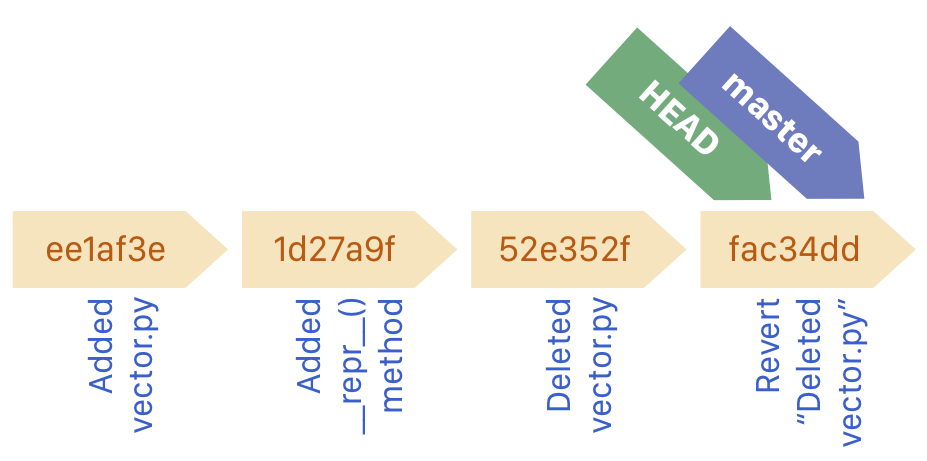
<br><b><i>
Reverting results in a new commit that does the reverse of the reverted commit.</i></b><hr>
</center>


##### Reverting by relative refererence

If you know you how many commits you want to go back, you can use a relative
reference when reverting. You can specify a reference relative to the current HEAD. HEAD is a tag that is always attached to the last commit of the current branch (more on branches later).
If you want to undo the last commit, you revert the commit tagged HEAD, by typing this:

```bash
$ git revert HEAD
```

This will have the same effect as reverting by identifier.


#### Undoing the N previous commits

**This should only be done on local repositories or branches, i.e. branches that are on your own computer. If you use it on online repositories it can result in data loss.**

You can undo multiple commits using `git reset --hard`. You specify the commit you want to return to using an identifier or a relative reference. For example, you can add the identifier

```bash
$ git reset --hard 1d27a9f
```

or use the relative reference

```bash
$ git reset --hard HEAD~2
```

to reset to the state of the repository two commits back. Note that this behavior is different from `revert` which *reverts* only those changes in the commit you specify, while `reset` *removes all commits after* the commit you specify. `reset` also does not require you to make a new commit because of this.

To test `git reset`, you can reset back to the commit in which you added the `__repr__()` method, which will the commits in which you deleted `vector.py` and reverted this deletion. If you followed the tutorial so-far, you can establish this with 

```bash
$ git reset --hard HEAD~2
```

If you now look at `git log` you will see that the history of the repository has changed because two commits have been removed. This is exactly the reason why it is dangerous when you use it on online repositories that are also used by others. This is reflected in this diagram:

<center>
<hr>
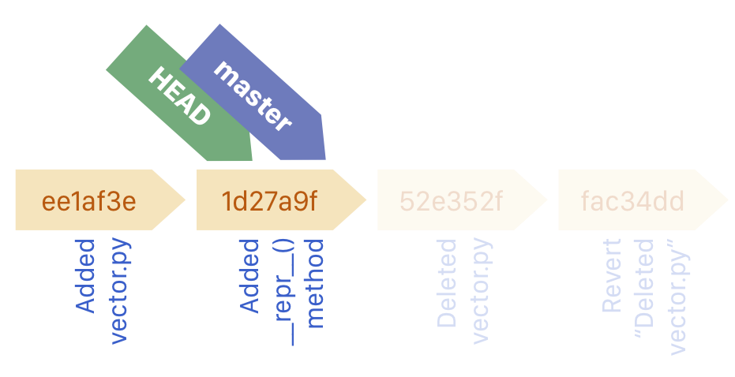
<br><b><i>
Resetting removes any subsequent commits from the history.</i></b>
</center>


#### Seeing differences between commit

Using `git diff` you can also see differences between commits. For this you again need an identifier or reference. For example, if you want to know what changed in the last commit, type

```bash
$ git diff HEAD~1
```

#### Checking out commits

Finally, there is one more useful command that you can use to check out the status of the repository in a commit. Using `git checkout <IDENTIFIER>` or `git checkout <RELATIVE REFERENCE>` to set the state of the folder to that commit. You can use this to check out the contents of files in that commit.

```bash
$ git checkout HEAD~1
Note: checking out 'HEAD~1'.

You are in 'detached HEAD' state. You can look around, make experimental
changes and commit them, and you can discard any commits you make in this
state without impacting any branches by performing another checkout.

If you want to create a new branch to retain commits you create, you may
do so (now or later) by using -b with the checkout command again. Example:

  git checkout -b <new-branch-name>

HEAD is now at ee1af3e Added vector.py

```

You are now in a detached HEAD state. That means that the commit you have checked out is no longer on a branch. HEAD is a label that points to the currently checked out commit, but the `master` branch in which you have been working is no longer associated with the same commit as HEAD is. 

<center>
<hr>
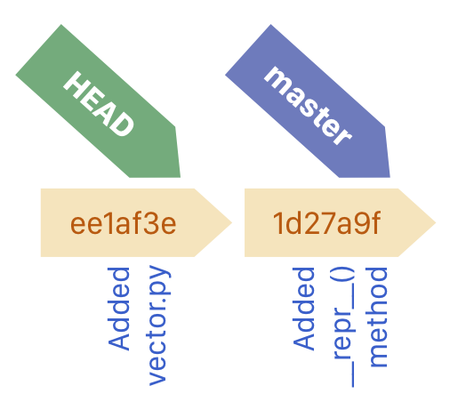
<br><b><i>
Checking out a commit moves the HEAD to that commit. The working directory will now contain the files in the state at that commit.</i></b>
</center>

To re-attach your HEAD and go back to the last commit, you type

<center>
<hr>

<br><b><i>
Re-attached HEAD by checking out `master`.</i></b>
</center>


```bash
$ git checkout master
```

(At least, assuming you have not changed branches, more on that later.)
Be careful though. If you make changes in a detached HEAD state, these will not be saved, unless you commit them to a new branch, and *merge* them. That is possible, but is beyond the scope of this tutorial.

###### Exercises

* Add a method `__len__()` to the `Vector` class:
    ```python
        def __len__(self):
            return len(self.elements)
    ```
    Commit the change and add an appropriate message.
    
    <details><summary>Answer</summary><p>
    Command:

    `git commit -a -m 'Added __len__() method'
    </p></details>

* Add a file called `test.py` with the following content:
    ```python
    from .vector import Vector
    v1 = Vector(1, 2, 3)
    v2 = Vector(3, 2, 1)
    print(v1)
    print(len(v2))
    print(v1 + v2)
    ```

    And commit this change to the repository

    <details><summary>Answer</summary><p>
    Commands:

    ```bash
    $ git add test.py
    $ git commit -a -m 'Added test module'
    ```
    </p></details>

* Delete the `test.py` and commit this change to the repository
    <details><summary>Answer</summary><p>
    Commands:

    ```bash
    $ git rm test.py
    $ git commit -a -m 'Removed test module'
    ```
    </p></details>

* Go back to the previous commit to restore the test module
    <details><summary>Answer</summary><p>
    Command:

    ```bash
    $ git revert HEAD
    ```
    
    to revert (undo) the last commit or

    ```bash
    $ git reset --hard HEAD~1
    ```

    to go back to the state of the repository one commit back.
    </p></details>

* Check the log of your repository.
    <details><summary>Answer</summary><p>
    Command:

    ```bash
    $ git log
    ```
    
    This should return something like this:

    ```bash
    commit 83b56a05dcfbb3dfdcc9b0a4afc1fcaceb06c7ca (HEAD -> master)
    Author: Amalia van Oranje <a.v.oranje@tue.nl>
    Date:   Wed Apr 24 11:58:54 2019 +0200

        Added test module.

    commit ea580441c928ac34b7e7ec840154868c24236717
    Author: Amalia van Oranje <a.v.oranje@tue.nl>
    Date:   Wed Apr 24 11:58:23 2019 +0200

        Added __len__() method

    commit 1d27a9f3b571a4a12e1d157b4abd036ec089da44
    Author: Amalia van Oranje <a.v.oranje@tue.nl>
    Date:   Wed Apr 24 11:36:30 2019 +0200

        Added __repr__() method

    commit ee1af3e89c2d41be17c85ad3d0d6383836258ec8
    Author: Amalia van Oranje <a.v.oranje@tue.nl>
    Date:   Wed Apr 24 11:34:02 2019 +0200

        Added vector.py
    ```

    </p></details>


## Branching and merging

Consider the following situation: you have a perfectly working folder full of wonderful code. Now, someone asks you to add some extra functionality to your code. This new code might break your perfect code, introduce bugs, or otherwise disturb your quiet life. Of course, Git allows you to go back in time to when things were working fine, but that would also remove all the work you did on the new functionality.

In this case, it is best to make a new *branch* in your repository.
Whenever you make a branch, the history of the repository splits in two. You can make commits in the new branch without it affecting the history or code in your main *master* branch.

The way this is often used is to have a stable master branch that contains well-tested code, and a development branch that has new functionality that has not been fully-tested yet. Once the new code *is* fully tested, you can merge the changes in the development branch into the master branch.


#### Branching

Creating and switching branches can be done using the `git checkout` command. In fact, switching branches is a little similar to switching to previous commits. Let's create a new branch called `addition`:

```bash
$ git checkout -b 'addition'
```

Git will respond with `Switched to a new branch 'addition'`. 

<center>
<hr>
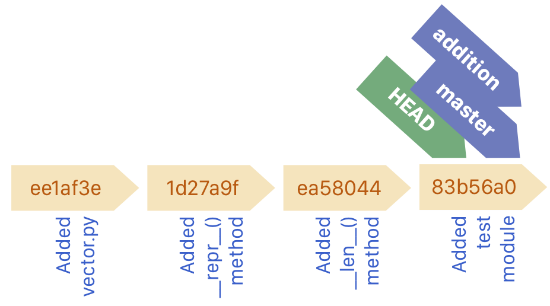
</center>

In this branch you can make changes to the code. For example, we can add an `__add__()` method to our `Vector` class, that returns the number of elements:

```python
class Vector:
    def __init__(self, *elements):
        self.elements = elements

    def __repr__(self):
        s = '['
        for x in self.elements:
            s += str(x) + ', '
        s += ']'
        return s

    def __len__(self):
        return len(self.elements)

    def __add__(self, other):
        assert len(self) == len(other)
        sums = []
        for a, b in zip(self.elements, other.elements):
            sums.append(a + b)
        return Vector(*sums)
```

Now, we commit this change:

```bash
$ git commit -a -m 'Added __add__() method'
```

<center>
<hr>
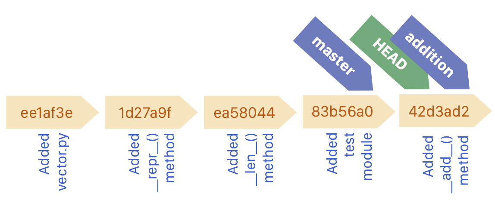
</center>


Remember that this change is only reflected in the `addition` branch we are in. The `master` branch has not had the same update. Let's check that out:

```bash
$ git checkout master
Switched to branch master
$ more vector.py
class Vector:
    def __init__(self, *elements):
        self.elements = elements

    def __repr__(self):
        s = '['
        for x in self.elements:
            s += str(x) + ', '
        s += ']'
        return s

    def __len__(self):
        return len(self.elements)
```

#### Listing all branches

To get an overview of all branches, use the command `git branch`, which will show a list of the branches with the currently checked out branch indicated with an asterisk. You can close this view by typing <kbd>q</kbd>.

#### Merging

Let's assume the new `__add__()` method has been extensively tested, and it works perfectly fine. We can now merge the feature branch `addition` into the master branch. This is done by first checking out the `master` branch if you haven't done so already,

```bash
$ git checkout master
Already on 'master'
```

and typing

```bash
$ git merge addition
```

<center>
<hr>
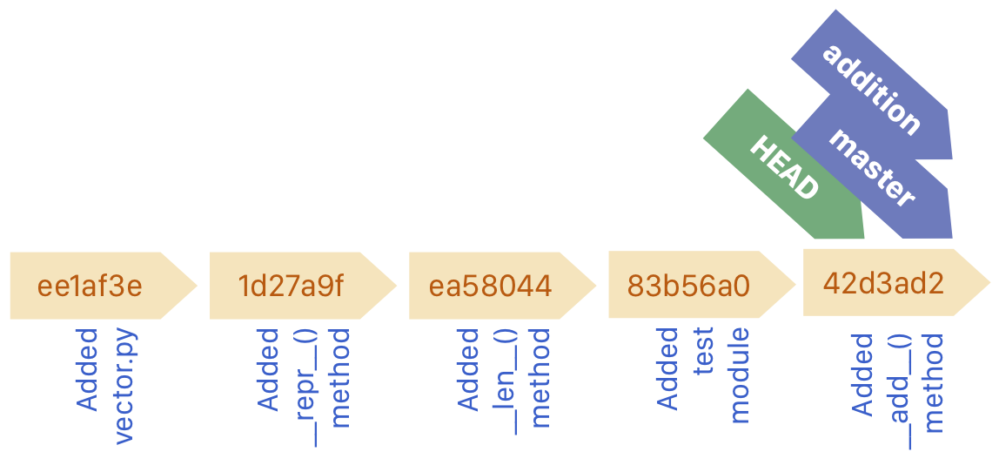
</center>


#### Merge conflicts

Say you have made two new additional features to the `Vector` class, each in their own branch from master. Let's call the branches `feature1` and `feature2`, like this:

```bash
$ git checkout master
$ git checkout -b feature1 
Switched to branch 'feature1'

        ... adding feature 1 ...

$ git commit -a -m commit 'Added feature 1'
[feature1 b016669] 2
 1 file changed, 1 insertion(+)

$ git checkout master
Switched to branch 'master'

$ git checkout -b feature2
Switched to branch 'feature2'

        ... adding feature 2 ...

$ git commit -a -m commit 'Added feature 2'
[feature2 b016669] 2
 1 file changed, 1 insertion(+)
```


<center>
<hr>
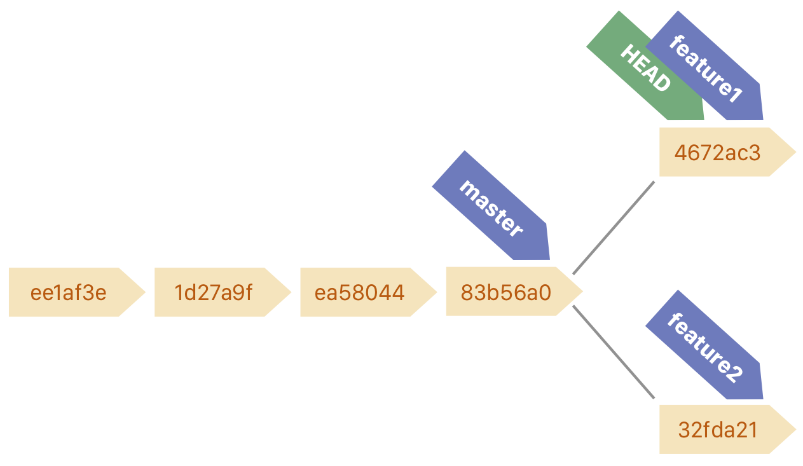
</center>


Now you want to merge both into master, so you checkout master, and merge the first feature:

```bash
$ git checkout master
Switched to branch 'master'

$ git merge feature1
Updating 4e26bf7..b016669
Fast-forward
 vector.py | 1 +
 1 file changed, 1 insertion(+)
```

<center>
<hr>
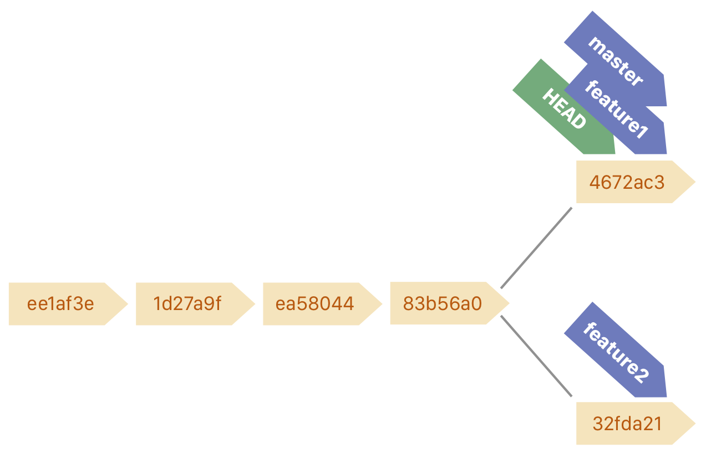
</center>

So far so good. Now, we also merge `feature2`:

```bash
$ git merge feature2
```

<center>
<hr>
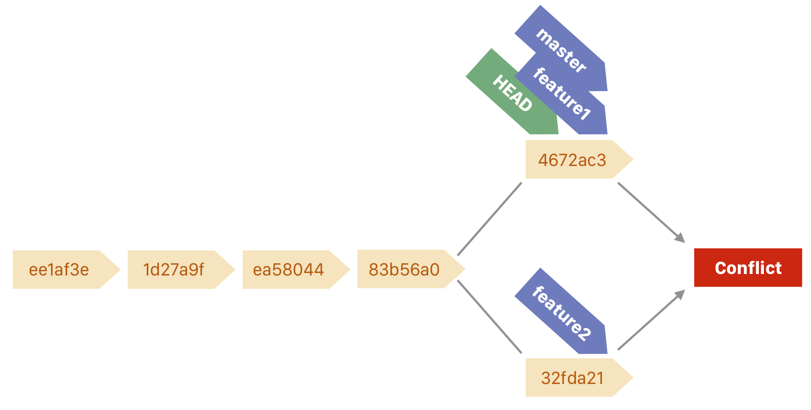
</center>

This will result in a warning:

```bash
Auto-merging vector.py
CONFLICT (content): Merge conflict in vector.py
Automatic merge failed; fix conflicts and then commit the result.
```

The reason for this is that both the `master` branch and the `feature2` branch are changed after the branching point, and both have changes to the same file(s). This results in Git not knowing which of the two existing versions is the 'truth'. Should the result have feature1 but not feature2, or feature2 but not feature1, or both, or neither?

This is called a *merge conflict*, and they are particularly abundant when collaborating. Luckily, merge conflicts are easy to solve. If you open the `vector.py` file you will see that Git has moved both features in the file, and you get to pick which version you want by removing text. For example, if the `__len__` and `__add__()` were added in `feature1` and `feature2` respectively, the file could look like this:

```python
class Vector:
    def __init__(self, *elements):
        self.elements = elements

    def __repr__(self):
        s = '['
        for x in self.elements:
            s += str(x) + ', '
        s += ']'
        return s

<<<<<<< HEAD
    def __len__(self):
        return len(self.elements)

=======
    def __add__(self, other):
        assert len(self) == len(other)
        sums = []
        for a, b in zip(self.elements, other.elements):
            sums.append(a + b)
        return Vector(*sums)
>>>>>>> feature2
```

The part between <<<<<<< and >>>>>>> is different in the `master` and `feature2` branches. The part above the `=======` is in `master`, the part below in `feature2`. In this case, you can resolve the conflict by simply removing the lines with `<<<<<<<< HEAD`, `=======`, and `>>>>>>> feature2` and saving the file. Then a new commit will close the conflict definitively:

```bash
$ git commit -a -m 'Merged feature2 into master and solved merge conflict.'
```

<center>
<hr>
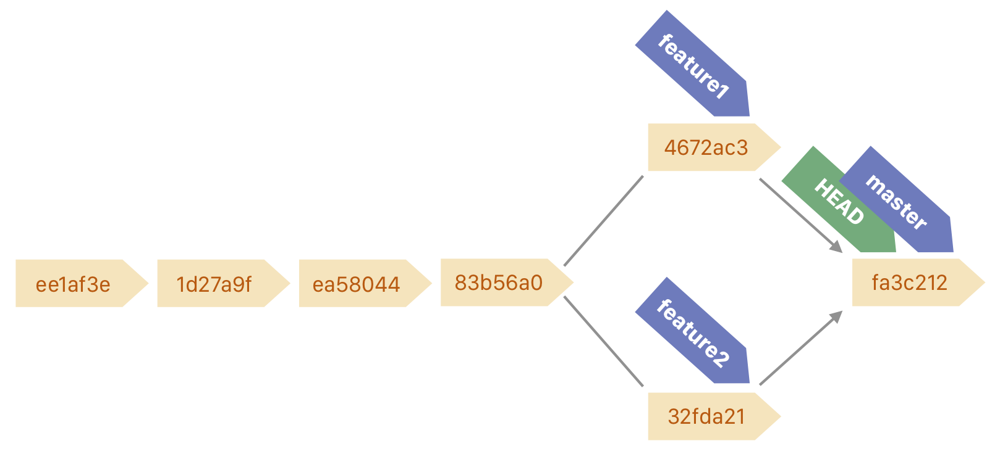
</center>

In the exercises we will see how to solve a merge conflict when two versions of the same function exist in two branches.

###### Exercises

* Create a new branch with an appropriate name and add the following method to the `Vector` class:

    ```python
        def __abs__(self):
            return Vector(*[abs(x) for x in self.elements])   
    ```
    Commit the change and add an appropriate message.
    
    <details><summary>Answer</summary><p>
    Commands:

    ```bash
    $ git checkout -b dev
    $ git commit -a -m 'Added __abs__() method to Vector class'
    ```
    </p></details>

* Go back to the `master` branch and add the following method to the `Vector` class:

    ```python
        def __abs__(self):
            c = 0
            for x in self.elements:
                c += x ** 2
            return c ** 0.5
    ```

    Commit the change and add an appropriate message.

    <details><summary>Answer</summary><p>
    Commands:

    `$ git checkout -b master`
    `$ git commit -a -m 'Added __abs__() method to Vector class'`
    </p></details>

* Merge the first branch into the `master` branch and solve the merge conflict.
    
    <details><summary>Answer</summary><p>
    The merge command

    `$ git merge dev`

    will result in a merge conflict that can be solved by opening the `vector.py` file, and removing the version of the `__abs__()` method you don't like. Then, commit the new version, like this:

    `$ git commit -a -m 'Merged dev branch and solved merge conflict.'`   
    </p></details>


## Collaborating on Github

So-far, the repository has been on your PC, i.e. it was a *local repository*. You can move your repository to GitHub or any other online service for hosting repositories. If you want you can try it on GitHub by making a free account. In this final section, we are going to simulate an online repository to convey the basics of pushing to online repositories, but it will be difficult to cover all facets without actually having a project on which you collaborate.

To simulate an online repository, make a new *empty* folder called `vector_example`, in a different location than where you would put your repositories normally. If you can't think of a good location, use your Desktop or Downloads folder. Navigate to this empty folder in the terminal, and type the following command:

```bash
$ git init --bare
```

This will make a bare repository. Bare repositories are usually hosted on a server. They are *not* meant for putting code in directly. They are only for storing a repository at a central place, such that anyone can edit and make commits to this repository. You can pretend that this repository lives on a drive in the cloud (like on GitHub).

#### Cloning repositories

*Cloning* means to make an exact copy of an online repository, including all previous commits. The corresponding command is `git clone`. For repositories on GitHub, such as the one on which this tutorial is stored, you can directly paste the link to the online repository after `git clone`. For example, 

```bash
$ git clone https://github.com/tueimage/essential-skills
```

will copy the repository to your computer.

We can do something similar with the simulated 'online' repository on your computer. Again, it is important you execute the following *in a different folder than where you put the bare repository*:

```bash
$ git clone /path/to/bare/repository/vector_example
Cloning into 'vector_example'...
warning: You appear to have cloned an empty repository.
done.
```

Naturally, this warning will not appear when you clone from an existing repository on GitHub. The repository you have cloned is on your PC but leads a double live on the (simulated) online repository, where other people can change the contents.


#### Pushing to online repositories

Let's add the `vector.py` file from the previous sections, and commit this file:

```bash
$ git add vector.py
$ git commit -m 'Added vector.py file'
```

Now, this file is added to the *local version of the repository*, which means it is not on the (simulated) online version. Let's change it there as well:

```bash
$ git push origin
Counting objects: 3, done.
Writing objects: 100% (3/3), 201 bytes | 201.00 KiB/s, done.
Total 3 (delta 0), reused 0 (delta 0)
To vector_example
 * [new branch]      master -> master
```

`origin` is a reference to the origin of the repository, i.e. where you cloned it from. The output shows that the changes in the master branch have been pushed to the online repository. In fact, *only* the changes in the master branch are updated using `git push`. If you want to push different branches, you first need to check these out. Alternatively, you can also specify which branch should be pushed, for example by doing

```bash
$ git push origin feature1
```

The output will show how many changes have been made and to which files.


#### Fetching changes from online repositories

So, how does this work? The online repository is also stored on your own computer as separate branches. For example, the `master` branch in the online repository is stored on your PC as well as the `origin/master` branch:

<center>
<hr>
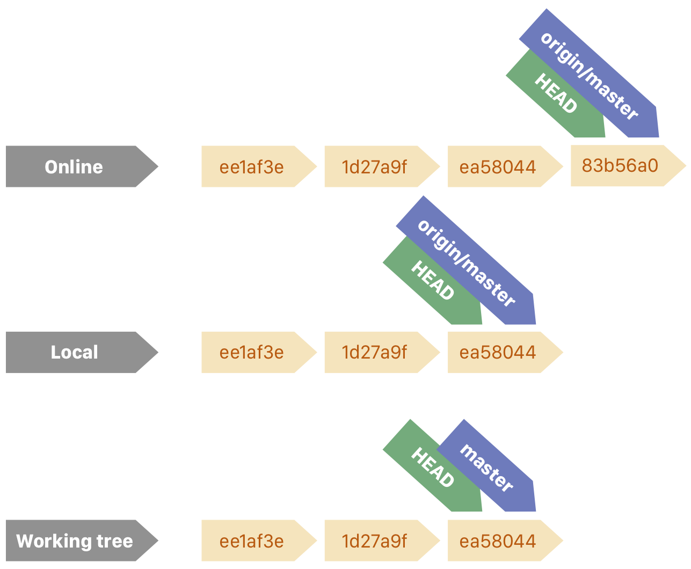
<br><b><i>
There are three representations of the repository: the online repository (on GitHub for example), the representation of that online repository on your PC, and the working directory. The online repository has a new commit made by someone else.</i></b>
</center>

You can inspect these branches by running

```bash
$ git branch -r
```

where `r` stands for 'remote'. You can quit from this view by pressing <kbd>q</kbd>. You will see that the following branches are there:

```bash
origin/HEAD -> origin/master
origin/master
```

These remote branches should be explicitly updated by you. You can do this by running

```bash
$ git fetch origin
```

which will copy the exact contents of the online repository to the `origin/...` branches on you PC. If someone else has pushed changes to the repository that are not yet on your PC, `git fetch` will get them to you.

<center>
<hr>
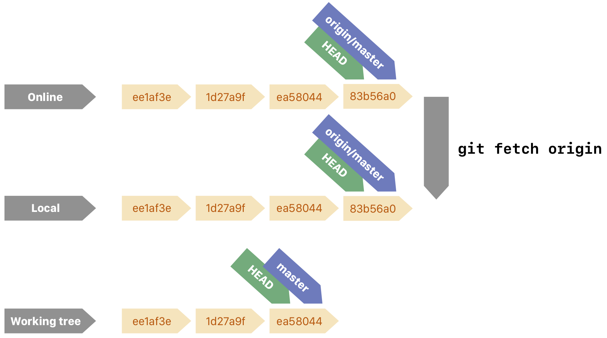
<br><b><i>
<tt>git fetch</tt> will update the local representations on your PC.</i></b>
</center>

However, these changes are not in your working tree (i.e. the local versions of the branches, e.g. `master`). To establish that, you need to merge the online branches into your local branches, simply by using `git merge`:

```bash
$ git checkout master
Switched to branch master
Your branch is three commits behind 'origin/master'
$ git merge origin/master
```

The result will look like this:

<center>
<hr>
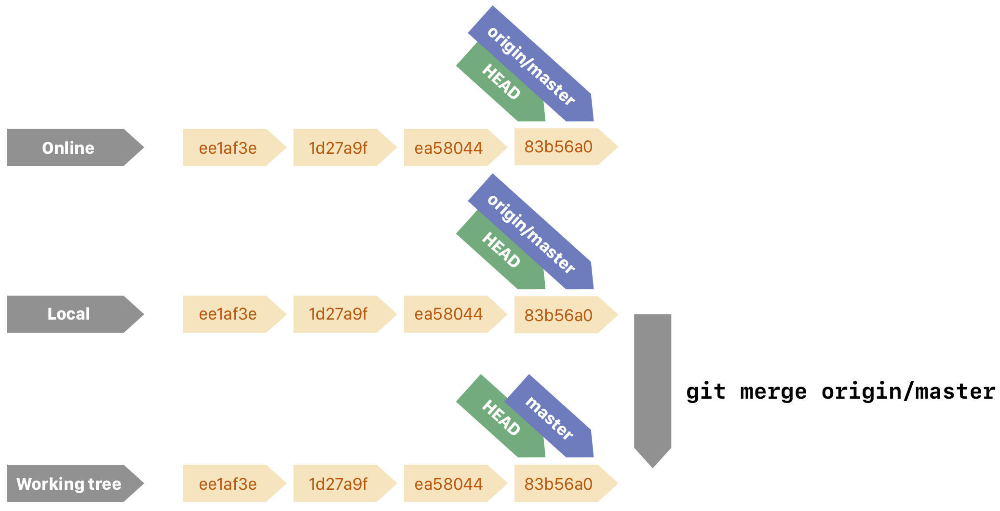
<br><b><i>
<tt>git merge origin/master</tt> merges the changes in the online repository into your own working working tree.</i></b>
</center>


#### Pushing changes when the online repository contains other changes

If your collaborators have pushed changes to the repository before you are pushing your changes, there will be an error like this

```bash
$ git push origin
 ! [rejected]        master -> master (non-fast forward)
error: failed to push some refs to 'vector_example'
```

The 'non-fast forward' message means that the changes you made cannot just be applied to the online repository. You will first need to fetch the changes your collaborators made and merge them with your local branch.

```bash
$ git fetch origin
$ git checkout master
Switched to branch master
Your branch is three commits behind 'origin/master'
$ git merge origin/master
    ... Solve merge conflicts here ...
$ git push origin
```

In effect, this is not much different from using branches on your local repository. To get a good grasp of using online repositories is to use them in practice. You can use this tutorial as a reference for the basic commands.


## Further info

This tutorial was written using the following references, which are useful to learn more advanced applications of Git:

* [Pro Git](https://git-scm.com/book/en/v2)
    * The go-to reference for Git
* [Learn Git Branching](https://learngitbranching.js.org)
    * An interactive tutorial on advanced Git branching with diagrams

This tutorial used the command line to use Git, however there are many GUI applications that you can use as well:

* [Sublime Merge](https://www.sublimemerge.com/)
    * Fully functional trial can be used indefinitely for free, available for Windows, macOS, and Linux
* [SourceTree](https://www.sourcetreeapp.com/)
    * Free, available for Windows and macOS
* [GitKraken](https://www.gitkraken.com/) 
    * Free, requires account, available for Windows, macOS, and Linux
* [GitHub Desktop](https://desktop.github.com/)
    * Free, requires Github account, available for Windows and macOS
